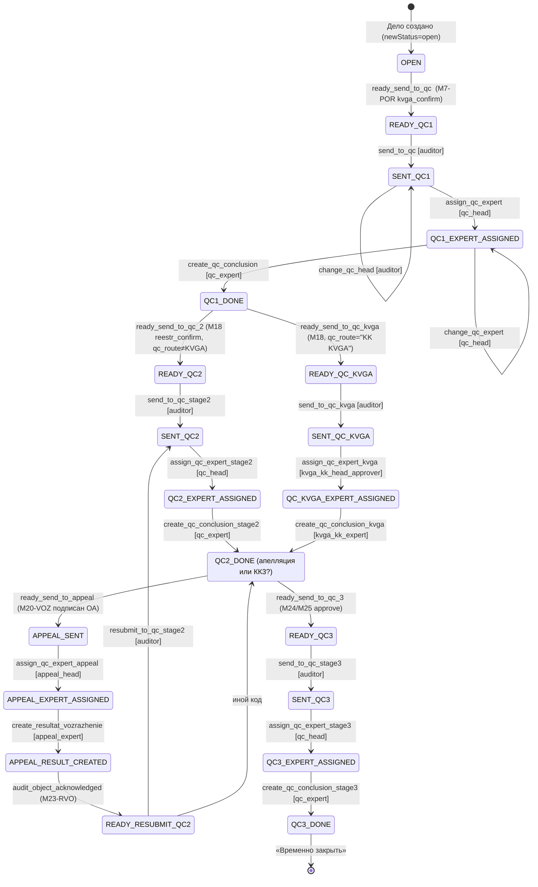

# BPMN-процессы Camunda 8 / Zeebe старой системы ЭВГА (n8n_old/bpmn): анализ, каталоги и рекомендация по переносу

Автор: агент-аналитик области «BPMN-процессы». Дата: 2026-09-21.

Источники (все прочитаны напрямую):
- `n8n_old_project_archive/bpmn/*.bpmn` — 72 файла `process-prc_*.bpmn`, а также готовые выжимки `bpmn_inventory.txt`, `bpmn_map.txt` (частичная), `bpmn_summary.txt`, `summarize_bpmn.py`.
- Собственный парсер `(рабочая папка анализа)/tmp_bpmn/parse_bpmn.py` (полный разбор XML: элементы, sequenceFlow с условиями, ioMapping, тела http-json коннекторов, сообщения, таймеры) → `bpmn_parsed.json`, `digest.txt` (5721 строк, прочитан целиком), `aggregate.py` → `aggregate.txt` (сводные каталоги).
- n8n-экспорт `n8n_old_project_archive/n8n_export/` (workflows/*.json, analysis/*_raw_dump.txt) — только в части контракта «BPMN ↔ n8n» (публикация сообщений Zeebe, check-docs-status, check-audit-type, старт процессов).
- Фронт ЭВГА: `saq-evga-test/src/modules/evga/documentStateMachine.ts`, `workflow.ts`, `src/types.ts` (DocStatus/Role), `src/data/documentMatrix.ts` (виды документов).
- Эталон prof: `saq-prof-control-demo/backend/apps/documents/services/prescription.py`, `documents/services/exceptions.py`, `documents/models.py` (`DocumentStatus`), `cases/services/case_status.py`.

Обозначения: ОА — объект аудита; КК — контроль качества; ЗКК — заключение КК; КВГА — комитет внутреннего государственного аудита (подтверждающее лицо); РГ — рабочая группа; ЕРСОП — единый реестр субъектов и объектов проверок; АК — апелляционная комиссия.

---

## 0. Резюме (главное за 2 минуты)

1. Все 72 файла — это 72 процесса Camunda 8 (Zeebe), из них **69 — жизненные циклы документов** (`evga_doc_*`, `Process_14ytj1q` «2.1 Аудиторский отчет», `m20_audit_objection`, `prc_JwETUJ5…` «М18 Реестр нарушений»), **1 — процесс дела** (`CaseProcessV1` «изменить статус дела»), **1 — обрубок** (`Process_1w9nalc`, без имени, без endEvent) и **1 — чужой демо-шаблон** (`send_notification`, к ЭВГА не относится).
2. Процессы **не содержат бизнес-логики**: каждый serviceTask — это HTTP-коннектор `io.camunda:http-json:1` в n8n (`/webhook/evga/workflow-update` — 461 вызов, `/webhook/evga/zeebe` — 46, `/webhook/evga/case-workflow-update` — 28, `/webhook/evga/check-docs-status` — 15, `/webhook/evga/documents` — 5, `/webhook/work-group-approval` — 3, `/webhook/evga/cases/bases` — 2, `/webhook/evga/check-audit-type` — 1). Тело `workflow-update` задаёт **статус документа и список кнопок** (`availableActions` c `code/name_ru/name_kz/icon/color/requires_signature/requires_comment/allowed_roles/assignment_type`). Вся «модель» — это конечный автомат «ждём сообщение → сравниваем `actionCode` → ставим новый статус и кнопки».
3. Единственный входной канал — сообщение Zeebe с именем **`TASK_COMPLETE_EVENT`**, корреляция `string(processData.documentId)` (для документов) или `string(processData.caseId)` (для `CaseProcessV1`). Объявленные, но **нигде не используемые** имена сообщений: `prev_document_approved`, `DOC_CONFIRM_EVENT`, `DOC_STATUS_CHANGED`, `CREATE_QC_CONCLUSION_EVENT`. Все «системные» события (`prev_approved`, `doc_approved`, `ersop_registered`, `zkk_confirmed`, `work_group_complete`, `signed_automatically`, `ready_send_to_qc*`…) идут тем же сообщением, просто с другим `actionCode`.
4. Реальная сложность мала: 45 различных статусов документа (из них 6 «ядро»: `draft, pending_approval, approved, pending_confirmation, revision, active`), ~90 кодов действий документа, 18 кодов действий дела, 17 ролей. Самый большой документный процесс — `prc_JwETUJ5…` (М18 Реестр нарушений): 25 serviceTask, 22 шлюза, 12 ожиданий. Параллельность — **один** parallelGateway во всех 72 файлах (M18: ожидание закрытия КК2 ‖ определение маршрута КК). Таймеры — **3**: `P10D` на возражения ОА (`evga_doc_51`) и `deadlineDatetime` в требованиях о сведениях (`evga_doc_info_request`, `evga_doc_m45_vk_treb`).
5. В наборе **два поколения** одних и тех же документов: (а) 18 процессов с зашитым URL `https://workflow.ecosystem.kz/…` и «номерными» именами «2.1/2.4/2.6/2.7/2.8/3.2/3.3/3.4/3.9/3.10/3.11» (`Process_14ytj1q`, `evga_doc_qc_stage1/2/3`, `evga_doc_violation_order`, `evga_doc_measures_response`, …) и (б) 54 процесса с `{{secrets.N8N_BASE_URL}}` и M-кодами (`M5-IPI, M6-PA-S/F, M7-POR, M8-PLAN, M9-AZ, M10-QC1, M17-AO-S/F, M18-RNS/RNAFO, M19-AD, M20-VOZ, M23-RVO, M24-AZK, M25-PRED, M26-TU`…), связанные между собой триггерами `trigger_doc_message`. Именно поколение (б) — «боевой» интегрированный набор; 17 пар дублей перечислены в §3.9.
6. **Рекомендация: Camunda/Zeebe не переносить.** Реализовать явные конечные автоматы в Django-сервисах в стиле prof (`documents/services/*.py`, `DocumentTransitionError`, `@transaction.atomic`), с декларативной таблицей переходов на тип документа (единый реестр статусов/действий/ролей из §2, §6–§8), журналом действий, вычисляемым статусом дела (как `cases/services/case_status.py: compute_status`) и **одним планировщиком дедлайнов** (management command по cron/K8s CronJob либо celery beat) для трёх таймеров и сроков из `deadlines.ts`. Обоснование и проект — §10.

---

## 1. Как устроен один процесс (общая механика)

### 1.1 Переменные процесса

| Переменная | Откуда | Где используется |
|---|---|---|
| `processData.documentId` | стартовые переменные (n8n стартует инстанс `POST {ZEEBE_API_BASE_URL}/process-instances?processId={zeebe_process_id}`, см. `analysis/cases_core_raw_dump.txt:142`) | correlationKey всех документных сообщений; `documentId` в теле `workflow-update` |
| `processData.caseId` | стартовые переменные | correlationKey `CaseProcessV1`; `case_id`/`caseId` в телах `zeebe`, `case-workflow-update`, `check-docs-status`, `cases/bases`, `check-audit-type` |
| `processData.auditTypeCode` | стартовые переменные; `"15"` — аудит соответствия, `"16"` — аудит финансовой отчётности | выбор кода документа: `M6-PA-S`/`M6-PA-F`, `M17-AO-S`/`M17-AO-F`, `M18-RNS`/`M18-RNAFO` |
| `processData.isRecreated` | стартовые переменные (`evga_doc_3_plan`) | пересозданный документ пропускает ожидание `prev_approved` |
| `taskVariable` | payload сообщения `TASK_COMPLETE_EVENT` (`eventData` в n8n: `{actionCode, performedByIin, performedByFullname, documentId, confirmerIin?, assignedToIin?, deadlineDatetime?, comment?}`) | условия шлюзов `=taskVariable.actionCode = "…"` либо, в новом поколении, через output-mapping `OutputVariable_xxx = taskVariable` |
| `isReactivation` | локальная, ставится output-mapping `=true` на «пустом» `workflow-update` (`availableActions: []`) при возврате от утверждающего | при повторном согласовании пропускает «разблокировку следующего документа» / проверки |
| `checkObjResult`, `checkBothResult`, `checkPlanResult`, `checkZadResult`, `checkPredResult` | `resultVariable` вызова `check-docs-status` | `…body.data.allExistingMatched = true`, `…body.data.foundCount = N` |
| `auditTypeCheckResult.body.isPlanned` | `check-audit-type` (плановость по `inspection_types.code in ['1','scheduled']`) | `evga_doc_accounting_card` |
| `caseBasesResult.body.qc_route` | `cases/bases` (обработчик в экспорте n8n отсутствует) | `= "KK KVGA"` → маршрут КК через КВГА (`prc_JwETUJ5…`, `evga_doc_37_kk2`) |

### 1.2 Сообщения (все процессы)

- 121 объявление `bpmn:message`; **все используемые** имеют `name="TASK_COMPLETE_EVENT"`. Разные id (`Message_DocAction`, `Message_16rohjb`, `Message_1ysgtld`, …) — одно и то же имя, т.е. один канал.
- Корреляция: `=string(processData.documentId)` — 69 документных процессов; `=string(processData.caseId)` — `CaseProcessV1` (все 3 его сообщения `Message_CaseAction`, `Message_DocAction`, `Message_1ysgtld`) и неиспользуемое `DOC_STATUS_CHANGED` в `evga_doc_m18_m19_auto_create`.
- Объявлены, но не подписаны ни одним catch-событием (refs=0): `Message_PrevDocApproved` (`prev_document_approved`) в `evga_doc_6_qc, _5_poruchenie, _ad, _3_plan, _2_pa, _4_az`; `DOC_CONFIRM_EVENT` (`evga_doc_rezultat_vozrazhenii`); `DOC_STATUS_CHANGED` (`m18_m19_auto_create`); `CREATE_QC_CONCLUSION_EVENT` и `Message_05lm36t` (`CaseProcessV1`); три сообщения в `Process_1w9nalc`.
- Следствие: инстанс в каждый момент ждёт ровно в одном catch-событии (кроме `parallelGateway` в M18). Любое действие UI доставляется как сообщение; если `actionCode` не совпал ни с одним условием, срабатывает default-поток «обратно в то же ожидание» (это и есть «кнопка Сохранить»: `save` нигде не проверяется, он просто «съедается» циклом).

### 1.3 Контракт с n8n (реконструирован по телам коннекторов; обработчики `/webhook/evga/zeebe`, `/workflow-update`, `/case-workflow-update`, `/cases/bases`, `/work-group-approval`, `/documents` в экспорте **отсутствуют**)

| Вебхук | Тело (FEEL) | Смысл |
|---|---|---|
| `POST /webhook/evga/workflow-update` | `{documentId, newStatus, isEditable, availableActions:[…], source:"zeebe", shouldCreateVersion?, performedByIin?, performedByFullname?, assignedToIin?}` | записать статус документа (`surfk.evga_case_documents.status_id` по коду), сохранить набор кнопок, при `shouldCreateVersion:true` создать новую версию документа (стоит в 103 задачах: все `revision` (42), `return` (15), `active` (15), `signed`, `approved`…; `false` — в `pending_*` у M18/М14) |
| `POST /webhook/evga/case-workflow-update` | `{caseId, newStatus?, availableActions:[…], performedByIin, actionCode, assignedToIin?, comment?}` | статус дела (`open, control, awaiting_objections, reviewing_objections, audit_materials_implementation, qc_approved, closed`) и кнопки карточки дела; журнал в `surfk.case_status_history` (см. `EVGA_Case_Workflow_Log_Zeebe_PostgreSQL`) |
| `POST /webhook/evga/zeebe` `{action:"publish_case_message", params:{case_id, action_code, user_iin, user_fullname}}` | опубликовать `TASK_COMPLETE_EVENT` с ключом `case_id` в `CaseProcessV1` | документ «толкает» дело |
| `POST /webhook/evga/zeebe` `{action:"trigger_doc_message", params:{case_id, doc_type, action_code, performedByIin, performedByFullname}}` | найти документ типа `doc_type` в деле и опубликовать ему `TASK_COMPLETE_EVENT` с этим `action_code` | документ «толкает» другой документ (`prev_approved`, `doc_approved`, `ersop_registered`, `zkk_confirmed`, `ready_kvga_confirmed`, `create_qc_conclusion_stage3`, `ready_send_confirmation`, `signed_automatically`) |
| `POST /webhook/evga/check-docs-status` `{params:{case_id, doc_types:[…], status}}` | `EVGA_Check_Documents_Status`: последняя не удалённая запись на тип; ответ `data.{allMatched, allExistingMatched, requiredCount, foundCount, matchedCount, docs[]}`. `allExistingMatched` = все существующие в статусе и хотя бы один есть (удалённый тип не блокирует) | предусловия («план/программа согласованы?», «оба М18+М19 активны?», «есть ли M19-AD/M25-PRED/M23-RVO?») |
| `POST /webhook/evga/check-audit-type` `{caseId}` | `EVGA_Check_Audit_Type_Planned_Unplanned` → `isPlanned` | после регистрации учётной карточки плановой проверки — сигнал поручению |
| `POST /webhook/evga/cases/bases` `{case_id}` | ответ `qc_route` (`"KK KVGA"` / иное) | выбор маршрута КК 2-го этапа |
| `POST /webhook/work-group-approval` `{action:"init", …}` | инициализация списка подписантов РГ; n8n сам шлёт `work_group_complete` / `approve_work_group`, когда все подписали | РГ-подписание |
| `POST /webhook/evga/documents` `{action:"create", …}` | создать документ (`M18-RNS`/`M18-RNAFO`, `M19-AD`, `M20-VOZ`, `M25-PRED`) | автосоздание |

Обратное направление (n8n → Zeebe): все пользовательские действия проходят через под-воркфлоу `$vars.ZEEBE_SEND_EVENT_WORKFLOW_ID` (в экспорте нет) с входами `processInstanceId, eventName:"TASK_COMPLETE_EVENT", correlationKey:String(case_document_id), eventData:{actionCode, performedByIin, documentId, confirmerIin?}` — вызывающие: `EVGA_Additional_Actions` (submit/approve/reject/confirm/return/send_to_confirmation/send_to_kvga/kvga_confirm/kvga_return/kvga_reject/activate/send_to_audit_object/direct_confirm/qc_close/accept/objection + generic), `EVGA_Docs_KVGA_Reestr`, `EVGA_Docs_Case_Misc`, `EVGA_ERSOP_Workflow` (`send_to_ersop`, `check_status` → `ersop_accepted/ersop_registered/ersop_rejected/ersop_revision/ersop_error`), `EVGA_Docs_CRUD` («Resolve Next Doc»: при удалении `M19-AD` → `doc_approved` отчёту; при удалении `M25-PRED` при согласованном заключении → `ready_send_to_qc_3` делу; карта `M9-AZ→[M7-POR]`, `M8-PLAN→[M9-AZ]` → `prev_approved` с guard `still`), `Appeals_-_Assign_Expert` и `assign-expert-to-case` (→ `publish_case_message`).

Старт документного процесса: `surfk.evga_document_types.zeebe_process_id` (колонка есть, сам справочник в дампах не выгружен — **точное соответствие «код документа → process id» см. §3.10, реконструировано по именам и триггерам**). У дела — `surfk.cases.zeebe_process_instance_id`, `workflow_state`.

### 1.4 Стандартная форма одного «шага»

```
[serviceTask http-json → workflow-update: newStatus=X, isEditable, availableActions=[…]]
        ↓
[intermediateCatchEvent: TASK_COMPLETE_EVENT, corr=documentId]  ←──┐ default (любой другой actionCode, в т.ч. save)
        ↓                                                         │
[exclusiveGateway: taskVariable.actionCode = "a" | "b" | …] ──────┘
        ↓ "a"                    ↓ "b"
[serviceTask → workflow-update: newStatus=Y …]   [… newStatus=Z …]
```

Всего по 72 файлам: 564 serviceTask, 381 exclusiveGateway, 3 eventBasedGateway, 1 parallelGateway, 328 catch-событий, 83 endEvent, 1747 потоков (418 с условием). Никаких userTask, DMN, вызовов подпроцессов (`callActivity`), error/boundary-событий, компенсаций — **ничего из «продвинутого» BPMN не используется**.

---

## 2. Общий шаблон жизненного цикла документа

### 2.1 Каталог статусов документа (`newStatus` в `workflow-update`; 45 значений)

| Статус | Смысл | Редактируем | Где (число процессов) |
|---|---|---|---|
| `draft` | Проект | да | 68 |
| `pending_approval` | На согласовании | нет | 36 |
| `approved` | Согласован (ждёт отправки на утверждение) | нет / **да** в поколении «adm/vk» (там кнопки `save`+`send_to_confirmation`) | 35 |
| `pending_confirmation` | На утверждении | нет | 38 |
| `revision` | На доработке (после `return` согласующего; в части процессов и утверждающего) | да | 46 |
| `return` | Возврат от утверждающего (отдельный статус, кнопки `save`+`send_to_confirmation`) | да | 15 |
| `active` | Активный / утверждён (терминальный либо «готов к отправке ОА») | нет (искл. `evga_doc_2_pa`: `active` с `isEditable:true` и кнопкой `return_to_draft`) | 59 |
| `confirmed` | Утверждён, но не «активен» до следующего шага (регистрация/ЕРСОП/отправка ОА) | нет / да (`m48`,`m54`: `save`+`send_to_ersop`) | 5 |
| `signed` | Подписан ЭЦП автором (ЗКК, акты, возражения, М16) | нет | 11 |
| `sent_to_audit_object` | Направлен ОА на ознакомление/подпись | нет / да (кнопка `audit_object_acknowledged` c подписью) | 14 |
| `oa_acknowledged` | ОА ознакомлен (терминал) | нет | 9 |
| `audit_object_acknowledged` | то же (другое написание: `info_request`, `violation_order`) | нет | 2 |
| `delivered_to_oa` | Доставлен ОА (`violation_order`, действие `receive`) | нет | 1 |
| `sent_to_oa` / `signed_by_oa` / `signed_with_objection` | Аудиторский отчёт у ОА / подписан / с возражением (`Process_14ytj1q`, `m18_m19_auto_create`) | нет | 1/1/2 |
| `signed_oa` / `signed_without_objection_oa` | Реестр нарушений подписан ОА без/с возражением (`prc_JwETUJ5`, `m18_m19_auto_create`) | нет | 2/1 |
| `signed_automatically` | Отчёт считается подписанным по истечении 10 дней | нет | 1 |
| `pending_kvga` | На подтверждении КВГА / подтверждающего реестра | нет | 3 |
| `kvga_confirmed` | Подтверждён КВГА | нет / да (`m43`) | 3 |
| `pending_work_group_approval` | На подписании РГ | нет | 3 |
| `sent_to_ersop` → `pending_for_consideration` → `registered_ersop` / `rejected_ersop` / `sent_revision_ersop` | Цепочка ЕРСОП | `sent_revision_ersop` — да | 5 каждый |
| `registered` | Зарегистрирован (без ЕРСОП-цепочки: `m44`, `m47`, `notification_slip`, `prikaz`) | нет | 4 |
| `sent` | Отправлен в ИС ВАП | нет | 1 |
| `sent_to_court` / `sent_to_law_enforcement` | Передан в суд / в ИС ПО | нет | 1/1 |
| `open` | Открыто (КК-«дело», ЗКК до создания) | да | 3 |
| `closed` | Дело КК закрыто | нет | 1 |
| `sent_to_qc` → `qc_acknowledged` → `expert_assigned` | КК3 (`evga_doc_qc_stage3`) | `expert_assigned` — да | 1 |
| `awaiting_info` / `sent_by_audit_object` / `under_review` / `send_to_auditor` / `overdue` / `info_accepted` / `info_refused` | Требование о сведениях (М15/М45) | `send_to_auditor` — да | 1–2 |
| `pending_oa_confirmation` / `oa_confirmed` / `sent_to_auditor` / `accepted` | Ответ о принятых мерах (ОА → подтверждающий ОА → аудитор) | нет | 1–2 |

### 2.2 Схема действий (`availableActions[i]`)

```json
{ "code": "approve", "name_ru": "Согласовать", "name_kz": "Келісу",
  "icon": "CheckOutlined", "color": "green",
  "requires_signature": true, "requires_comment": false,
  "allowed_roles": ["approver"], "assignment_type": "approver" }
```
- `icon` — имя иконки Ant Design (`SaveOutlined, SendOutlined, CheckOutlined, CheckCircleOutlined, FileDoneOutlined, RollbackOutlined, SwapOutlined, UserSwitchOutlined, UserAddOutlined, FolderAddOutlined, FileAddOutlined, EyeOutlined, EditOutlined, UploadOutlined, DownloadOutlined, SyncOutlined, CloseCircleOutlined, CloseOutlined, ExclamationCircleOutlined, SafetyCertificateOutlined, CloudUploadOutlined, FileSearchOutlined, PlusOutlined`).
- `color` — `default | blue | green | orange | red | purple`.
- `requires_signature` — ЭЦП (NCALayer) обязательна; `requires_comment` — обязателен комментарий (у всех `return`/`reject`/`*_reject`/`refuse_info`/`mark_refused`).
- `assignment_type` (встречается в 36 файлах; значения: `approver` 58, `author` 52, `confirmer` 46, `qc_head` 8, `kvga_confirmer` 3, `qc_expert` 3, `workgroup` 3, `workgroup_lead` 3, `appeal_head` 2, `reestr_confirmer` 2, `kvga_kk_expert` 1) — какому *назначенному* участнику документа адресована кнопка (не роль Keycloak вообще, а конкретное лицо, назначенное на документ: `assignedToIin`/`confirmerIin`).
- `action_type` (только в `case-workflow-update`): `dropdown` (21, `add_document`) | `button` (14).

### 2.3 Семейства шаблонов (по 69 документным процессам)

| Семейство | Цепочка состояний | Процессы |
|---|---|---|
| **T0 Активация** | `draft —activate→ active` (иногда + `active —registered/register_ersop→ registered`; `draft —sign→ active`; `draft —send_to_vap→ sent`) | `m38_adm_osn, m42_adm_kvit, m50_adm_prot_uo, m52_adm_oplata, m53_adm_1ap, lawsuit_decision, reshenie_iskovoe, law_enforcement_response, otvet_pravoohran, m44_vk_uk, m47_vk_tu, notification_slip, weekly_report, vap_notification` |
| **T1 Согласование+утверждение** | `draft —submit→ pending_approval —approve→ approved —send_to_confirmation→ pending_confirmation —confirm→ active`; `return` согласующего → `revision —submit→ pending_approval`; `return` утверждающего → `return —send_to_confirmation→ pending_confirmation` (T1a) либо → `revision` (T1b); `change_approver`/`change_confirmer` — петля в том же состоянии | T1a: `m39_adm_prot, m40_adm_post_vz, m41_adm_post_pr, m49_adm_voz, m57_adm_resh, m46_vk_akt, m56_vk_akt_vos, m48_adm_1av, m54_vk_dop_por, prikaz, iskovye_zayavleniya, peredacha_pravoohran, peredacha_upoln, spravka_zavershenia(→revision), otvet_mery`; T1b: `transfer_law_enforcement, transfer_authority, audit_completion_cert, lawsuit, audit_evidence, ad, 1_irpi, 2_pa, 3_plan, 4_az, 5_poruchenie, additional_order, audit_conclusion, predpisanie, measures_response, objection_results` |
| **T2 + Ознакомление ОА** | `active —send_to_audit_object→ sent_to_audit_object —audit_object_acknowledged/oa_acknowledge/acknowledge→ oa_acknowledged` (`violation_order`: `—send_to_oa→ sent_to_audit_object —receive→ delivered_to_oa —acknowledge→ audit_object_acknowledged`) | `5_poruchenie, additional_order, m43_vk_por, m55_vk_akt_osm, predpisanie, audit_conclusion, certificate_of_refusement, m21_ako, rezultat_vozrazhenii, violation_order` |
| **T3 ЕРСОП** | `X —send_to_ersop(ЭЦП)→ sent_to_ersop[check_status] —ersop_accepted→ pending_for_consideration[check_status] —ersop_registered→ registered_ersop` / `—ersop_rejected→ rejected_ersop` / `—ersop_revision→ sent_revision_ersop —send_to_ersop→ …`; `ersop_error` → обратно в X | `accounting_card (X=draft), additional_order (X=active), m48_adm_1av, m54_vk_dop_por (X=confirmed), talon_uvedomlenie (X=draft)` |
| **T4 КВГА / подтверждающий реестра** | `approved —send_to_kvga→ pending_kvga —kvga_confirm→ kvga_confirmed —send_to_confirmation→ pending_confirmation`; `kvga_reject`/`return`/`reject` → `revision`; `change_kvga_confirmer` | `5_poruchenie, m43_vk_por`; вариант реестра: `prc_JwETUJ5` (`send_to_reestr_confirmer/reestr_confirm/reject/change_reestr_confirmer`) |
| **T5 Рабочая группа** | `draft|approved —send_to_work_group→ pending_work_group_approval —(sign_work_group × N; n8n шлёт work_group_complete / approve_work_group)→ signed|active` | `4_az, m18_m19_auto_create (аудиторский отчёт), m21_ako` |
| **T6 ЗКК / КК** | см. §3.3: `7_zkk, 37_kk2, 46_kk3` (M-поколение), `qc_stage1/2/3` (номерное поколение), `6_qc` «Дело КК» | |
| **T7 Требование сведений с таймером** | см. §5.2 | `info_request (М15), m45_vk_treb (М45)` |
| **T8 Документы, авторизуемые ОА** | `draft —signed/sign/submit(ЭЦП)→ signed|active`, далее `send_to_ak`; ответ о мерах: `draft —verification/send_to_oa_confirmation→ pending_oa_confirmation —oa_confirm→ oa_confirmed —with_auditor/send_to_auditor→ …` | `51, oa_objection, m20_audit_objection, otvet_mery, measures_response` |
| **T9 Апелляция** | `objection_results`: `draft —send_to_confirmation→ pending_confirmation —confirm(appeal_head)→ active` → дело `audit_materials_implementation`; `rezultat_vozrazhenii`: `draft —sign→ approved —send_to_confirmation→ pending_confirmation —confirm→ active —send_to_audit_object→ sent_to_audit_object —audit_object_acknowledged→ oa_acknowledged` → `publish_case_message(audit_object_acknowledged)` | |

### 2.4 Автоматические (системные) действия и связь с делом

| Код (в `taskVariable.actionCode`) | Кто публикует | Кому | Смысл |
|---|---|---|---|
| `prev_approved` | `trigger_doc_message` из ИПИ/Программы/Плана/Задания/М18/М19/ЗКК; n8n при удалении документа | следующему по цепочке документу | «предыдущий документ утверждён — разблокировать кнопку `submit`» (ИПИ→Программа `M6-PA-S/F`; Программа→План `M8-PLAN`/Задание `M9-AZ`/Поручение `M7-POR`; План→Задание/Поручение; Задание→Поручение; М18↔М19) |
| `doc_approved` | М19 / М18 | аудиторскому отчёту `M17-AO-S/F` | оба документа активны → отчёт можно направлять ОА (`Task_CheckBothApproved`) |
| `ersop_registered` | учётная карточка (если плановая), уведомление ВАП | поручению `M7-POR` | поручение можно направить ОА |
| `ready_kvga_confirmed` | ЗКК `7_zkk`, дело КК `6_qc` | ИПИ `M5-IPI` / поручению `M7-POR` | после закрытия КК1 разблокировать утверждение |
| `zkk_confirmed` | `qc_stage1` | `M10-QC1` (дело КК) | закрыть дело КК |
| `create_qc_conclusion_stage3` | `46_kk3` (ЗКК3 утверждён) | `M24-AZK`, `M25-PRED` | заключение/предписание → «отправить на утверждение» |
| `ready_send_confirmation` | `37_kk2` | `M18-RNS/RNAFO` | реестр → на утверждение после КК2 |
| `signed_automatically` | `evga_doc_51` по таймеру P10D | `M17-AO-S/F` | отчёт подписан автоматически |
| `work_group_complete`, `approve_work_group` | n8n `work-group-approval` | документ РГ | все подписали |
| `ersop_accepted/ersop_registered/ersop_rejected/ersop_revision/ersop_error` | `EVGA_ERSOP_Workflow` (по `check_status`) | документ | ответ ЕРСОП |
| `publish_case_message`: `ready_send_to_qc`, `ready_send_to_qc_2`, `ready_send_to_qc_kvga`, `ready_send_to_qc_3`, `ready_send_to_appeal`, `audit_object_acknowledged`, `qc_3_completed`, `closed`, `default`, `status_change` | документы | `CaseProcessV1` | документ переводит дело на следующий шаг (см. §4) |
| `case-workflow-update newStatus` | документы напрямую | дело | `control` (отчёт создан), `awaiting_objections` (отчёт направлен ОА), `reviewing_objections` (подписан с возражением), `audit_materials_implementation` (результаты возражений активны / отчёт подписан), `qc_approved` (КК1/КК2 утверждён), `closed` (КК3 утверждён) |


---

## 3. Полная таблица по всем 72 процессам

Колонки: **process id** (файл `process-<prc_…>.bpmn`, приведён префикс id файла) | **название** (атрибут `name`) | **документ / код** | **состояния** (`newStatus`) | **действия** (коды `availableActions`; `[ЭЦП]` = `requires_signature:true`) | **роли** (`allowed_roles`) | **таймеры** | **особенности / отклонения от шаблона** (семейства T0–T9 из §2.3; st/gw/wait — число serviceTask / шлюзов / ожиданий).

### 3.1 Подготовительный этап (13)

| № | process id | название | документ/код | состояния | действия | роли | таймеры | особенности |
|---|---|---|---|---|---|---|---|---|
| 1 | `evga_doc_1_irpi` (prc_EXhNvIem…) | EVGA Doc 1: ИПИ | `M5-IPI` | draft, pending_approval, approved, pending_confirmation, revision, active | save, submit, approve[ЭЦП], return, change_approver, send_to_confirmation, confirm[ЭЦП], change_confirmer | auditor, approver, confirmer | — | T1b + «разблокировки». После `approve` → `approved` (без кнопок) → `trigger_doc_message(prev_approved → M6-PA-S при auditTypeCode=15, иначе M6-PA-F)` → ждёт `ready_kvga_confirmed` (от ЗКК `7_zkk`/`6_qc`) → только тогда кнопка `send_to_confirmation` → `pending_confirmation` → `confirm` → `active` → повторный `prev_approved` → M6-PA-*. Возврат утверждающего ставит `isReactivation=true` → при повторном `approve` сразу «на утверждение» (без ожидания КК). 12 st / 10 gw / 5 wait |
| 2 | `evga_doc_2_pa` (prc_toEqkCXs…) | EVGA Doc 2: Программа аудита | `M6-PA-S` / `M6-PA-F` | draft, pending_approval, approved, pending_confirmation, revision, active | save, submit[ЭЦП], approve, return, change_approver, send_to_confirmation, confirm, change_confirmer, **return_to_draft**[approver] | auditor, approver, confirmer | — | Старт: `draft` только с `save` → ждёт `prev_approved` (от ИПИ) → `draft(save, submit)`. После `approve` (первый раз): `check-docs-status` M8-PLAN draft → `prev_approved` → M8-PLAN, иначе M9-AZ → M9-AZ, иначе → M7-POR; затем ждёт `prev_approved` («активация ИПИ») → `approved(send_to_confirmation)` → … → `active` → те же разблокировки со статусом `approved` → `active` с `isEditable:true` и кнопкой `return_to_draft` → ждёт `audit_otchet_sent_to_oa` (код никто не публикует — мёртвая ветка) либо `return_to_draft` → `draft(save, submit)`, `isReactivation=true`. Самый ветвистый подготовительный: 22 st / 18 gw |
| 3 | `evga_doc_3_plan` (prc_eV8UrhvM…) | EVGA Doc 3: План аудита | `M8-PLAN` | как № 1 | как № 1 | auditor, approver, confirmer | — | `processData.isRecreated=true` пропускает ожидание `prev_approved`. После `approve`: если пересоздан/реактивация → сразу `send_to_confirmation`; иначе проверка M9-AZ draft → `prev_approved` → M9-AZ, иначе → M7-POR; ждёт `prev_approved` («активация программы») → `send_to_confirmation` → `confirm` → `active` → повторная разблокировка M9-AZ/M7-POR. 15 st / 16 gw |
| 4 | `evga_doc_4_az` (prc_xSty0XCA…) | EVGA Doc 4: Аудиторское задание | `M9-AZ` | draft, pending_approval, revision, approved, pending_work_group_approval, active | save, submit[ЭЦП], approve, return, change_approver, send_to_work_group, sign_work_group[ЭЦП; auditor, invited_specialist], approve_work_group[ЭЦП; auditor] | auditor, approver, invited_specialist | — | T1 без утверждающего + T5. Старт: `draft(save)` → ждёт `prev_approved` → `check-docs-status` [M6-PA-S, M6-PA-F] approved (`allExistingMatched`) → `draft(save, submit)`. После `approve` → `prev_approved` → M7-POR → ждёт `prev_approved` → `approved(send_to_work_group)` → `pending_work_group_approval` → `work-group-approval init` → по `approve_work_group` → `active` → `prev_approved` → M7-POR. 12 st / 13 gw |
| 5 | `evga_doc_5_poruchenie` (prc_EZH6LMHw…) | EVGA Doc 5: Поручение | `M7-POR` | draft, pending_approval, approved, pending_kvga, kvga_confirmed, pending_confirmation, revision, active, sent_to_audit_object, oa_acknowledged | save, submit[ЭЦП], approve, return, change_approver, send_to_kvga, kvga_confirm[ЭЦП], kvga_reject, change_kvga_confirmer, send_to_confirmation, confirm, change_confirmer, send_to_audit_object, audit_object_acknowledged[ЭЦП] | auditor, approver, kvga_confirmer, confirmer, audit_object_signer | — | T1b + T4 + T2 + связь с делом. `draft(save)` → ждёт `prev_approved` → `check-docs-status` [M8-PLAN, M6-PA-S, M6-PA-F] approved → `draft(save, submit)` → … `approved(send_to_kvga)` → `pending_kvga`: `kvga_confirm` → `kvga_confirmed` → (первый раз) `publish_case_message(ready_send_to_qc)` → ждёт `prev_approved` (после КК1) → `kvga_confirmed(send_to_confirmation)` → … `active` → ждёт `ersop_registered` (от учётной карточки М11 / ВАП М13) → `active(send_to_audit_object)` → `sent_to_audit_object` → `oa_acknowledged`. **`kvga_return` → `publish_case_message(closed)`** (дело закрывается при неподтверждении КВГА). 17 st / 16 gw / 11 wait — самый длинный подготовительный |
| 6 | `evga_doc_accounting_card` (prc_6dGTztBT…) | EVGA: Учетная карточка (М11) | `M11` | draft, sent_to_ersop, pending_for_consideration, registered_ersop, rejected_ersop, sent_revision_ersop | save, send_to_ersop[ЭЦП], check_status | auditor | — | Чистая T3. После `registered_ersop` → `check-audit-type` → `isPlanned=true` → `trigger_doc_message(ersop_registered → M7-POR)`. `ersop_error` → назад в `draft`. 8 st |
| 7 | `evga_doc_vap_notification` (prc_oAxKIJXQ…) | EVGA: Уведомление для ИС ВАП (М13) | `M13` | draft, sent | save, send_to_vap[ЭЦП] | auditor | — | T0. После `sent` → `trigger_doc_message(ersop_registered → M7-POR)` (внеплановые проверки: вместо учётной карточки) |
| 8 | `evga_doc_additional_order` (prc_PhgGEyAn…) | EVGA: Дополнительное поручение (М14) | `M14` | draft, pending_approval, approved, pending_confirmation, revision, active, sent_to_ersop, pending_for_consideration, registered_ersop, rejected_ersop, sent_revision_ersop, sent_to_audit_object, oa_acknowledged | save, submit, approve, return, change_approver, send_to_confirmation, confirm, change_confirmer, send_to_ersop[ЭЦП], check_status, send_to_audit_object, audit_object_acknowledged[ЭЦП] | auditor, approver, confirmer, audit_object_signer | — | T1b + T3 (из `active`: «Подписать и отправить в ЕРСОП») + T2 (после `registered_ersop` → `active(send_to_audit_object)`). Возврат утверждающего → `revision(save, send_to_confirmation)` минуя согласование. `ersop_error` → назад в `active`. 16 st / 9 gw / 10 wait |
| 9 | `evga_doc_info_request` (prc_Rti1U2eI…) | EVGA: М15 Требования по предоставлению сведений | `M15` | draft, active, sent_to_audit_object, audit_object_acknowledged, send_to_auditor, overdue, info_accepted, info_refused | save, sign[ЭЦП], send_to_audit_object, acknowledge, provide_info, refuse_info, accept_info[ЭЦП], reject_info[ЭЦП], resend_to_oa, mark_refused | auditor, audit_object_signer | `Event_TimerDeadline`: timeDate = `taskVariable.deadlineDatetime` (иначе 9999-12-31) | T7 (§5.2). `eventBasedGateway`: сведения ОА vs таймер → `overdue(resend_to_oa, mark_refused)`. Ожидание `draft→active` без шлюза (любое сообщение = подписано). 8 st / 7 gw / 7 wait / 2 end |
| 10 | `evga_doc_certificate_of_refusement` (prc_oqoH0bTt…) | EVGA: Акт об отказе (М15) | `M15` (акт об отказе в предоставлении сведений) | draft, signed, pending_confirmation, revision, active, sent_to_audit_object, oa_acknowledged | save, sign[ЭЦП], send_to_confirmation, confirm[ЭЦП], return, change_confirmer, send_to_audit_object, audit_object_acknowledged[ЭЦП] | auditor, confirmer, audit_object_signer | — | Без согласующего: `draft —sign→ signed —send_to_confirmation→ pending_confirmation —confirm→ active —send_to_audit_object→ sent_to_audit_object → oa_acknowledged`; `return → revision(save, sign)`. Ожидания отправки/ознакомления без шлюзов. 7 st |
| 11 | `evga_doc_access_denial_act` (prc_Kz8UauRM…) | EVGA: М16 Акт об отказе в доступе | `M16` | draft, signed, pending_confirmation, revision, active | save, sign[ЭЦП], send_to_confirmation, change_confirmer, confirm[ЭЦП], **return_for_revision**, resubmit[ЭЦП] | auditor, confirmer | — | Номерное поколение (URL `workflow.ecosystem.kz`). `resubmit` → `signed`. Уникальный код возврата `return_for_revision` |
| 12 | `evga_doc_prikaz` (prc_fsJ1gxFe…) | EVGA Doc: Приказ о начале / Приказ о завершении | (без M-кода) | draft, pending_approval, approved, pending_confirmation, revision, return, confirmed, registered | save, submit, approve, return, change_approver, send_to_confirmation, confirm, change_confirmer, register | auditor, approver, confirmer | — | T1a; после `confirm` → `confirmed(register)` → `registered` (регистрация одним нажатием, без ЕРСОП-цепочки) |
| 13 | `evga_doc_weekly_report` (prc_dAT6kCyB…) | EVGA: Еженедельный отчет (2.4) | (2.4) | draft, active | save, sign[ЭЦП] | auditor | — | T0 (`draft —sign→ active`), `shouldCreateVersion:false` |

### 3.2 Основной этап: отчёт, реестр, доказательства, возражения, апелляция (11)

| № | process id | название | документ/код | состояния | действия | роли | таймеры | особенности |
|---|---|---|---|---|---|---|---|---|
| 14 | `Process_14ytj1q` (prc_OkBFG17S…) | 2.1: Аудиторский отчет | аудиторский отчёт (номерное поколение) | draft, pending_approval, revision, pending_confirmation, confirmed, sent_to_oa, signed_by_oa, signed_with_objection | save, submit[ЭЦП], approve[ЭЦП], return, send_to_confirmation, confirm[ЭЦП], send_to_audit_object[auditor, approver, confirmer], send_to_oa, accept[ЭЦП], objection, create_objection_doc | auditor, approver, confirmer, oa_responsible | — | §5.1. После `approve` → **`draft`**(save, send_to_confirmation) — статус `approved` не используется; ответ ОА: `accept` → `signed_by_oa`; `objection` → `signed_with_objection(create_objection_doc)` → ждёт `Message_0g9k0qw` → конец. Ветка `Task_SetConfirmed(send_to_oa) → Event_WaitSendOA → Gateway_SendOAAction → Task_SetSentToOA` не имеет входящих потоков (мёртвый код). 10 st / 6 gw / 8 wait |
| 15 | `evga_doc_m18_m19_auto_create` (prc_Rpqtl9Q9…) | EVGA: Автосоздание M18 и M19 (фактически — жизненный цикл Аудиторского отчёта M17) | `M17-AO-S` / `M17-AO-F` | draft, pending_work_group_approval, signed, pending_approval, revision, active, sent_to_audit_object, signed_oa, signed_with_objection, signed_automatically | save, send_to_work_group, sign_work_group[ЭЦП; auditor, invited_specialist], submit, approve, return, change_approver, send_to_audit_object, acknowledge, sign_without_objection[ЭЦП], sign_with_objection[ЭЦП] (+ дело: add_document) | auditor, invited_specialist, approver, audit_object_signer | — (таймер P10D живёт в `evga_doc_51`) | §5.3. Старт: `check-docs-status` [M18-RNAFO, M18-RNS, M19-AD] draft; `foundCount=2` → пропуск, иначе создать M18-RNS (15) / M18-RNAFO (16) и M19-AD через `/documents create`. Дело → `control`. T5 (РГ) → `signed(submit)` → `pending_approval` → `approve` → `active` → `prev_approved` → M18-* → ждёт `doc_approved` (оба М18+М19 активны) → `active(send_to_audit_object)` → дело `awaiting_objections` → `sent_to_audit_object(acknowledge)` → кнопки подписи ОА: `sign_without_objection` → `signed_oa` → дело `audit_materials_implementation`; `sign_with_objection` → `signed_with_objection` → дело `reviewing_objections` → создать M20-VOZ → ждёт `signed_automatically` (от `evga_doc_51`) → `signed_automatically` → дело `audit_materials_implementation`. 25 st / 14 gw / 9 wait |
| 16 | `prc_JwETUJ5Idw7y4AnvNvhyFxuRrB2` (prc_JwETUJ5I…) | EVGA: М18 Реестр нарушений | `M18-RNS` / `M18-RNAFO` | draft, pending_approval, approved, pending_kvga, kvga_confirmed, pending_confirmation, revision, active, sent_to_audit_object, signed_oa, signed_without_objection_oa | save, submit[ЭЦП], approve, return, change_approver, send_to_reestr_confirmer, reestr_confirm[ЭЦП], reject, change_reestr_confirmer, send_to_confirmation, confirm, change_confirmer, send_to_audit_object, sign_without_objection[ЭЦП], sign_with_objection[ЭЦП] | auditor, approver, reestr_confirmer, confirmer, audit_object_signer | — | §5.4. Самый сложный документный процесс: 25 st / 21 xor + 1 **parallelGateway** / 12 wait. Единственное место с параллельностью (ожидание `ready_send_confirmation` от КК2 ‖ запрос `cases/bases` → `qc_route`). **Баг именования**: `sign_with_objection` → статус `signed_without_objection_oa`, `sign_without_objection` → `signed_oa` |
| 17 | `evga_doc_audit_evidence` (prc_43w5EwT0…) | EVGA: М19 Аудиторские доказательства (номерное) | `M19` | draft, pending_approval, approved, revision, pending_confirmation, active | save, send_to_approval, approve[ЭЦП], return_from_approval, change_approver, send_to_confirmation, resubmit, confirm[ЭЦП], return_from_confirmation, change_confirmer | auditor, approver, confirmer | — | Уникальные коды `send_to_approval / return_from_approval / return_from_confirmation`; `resubmit` из `revision` ведёт сразу в `pending_confirmation` даже после возврата согласующего (дефект). Автономен |
| 18 | `evga_doc_ad` (prc_Y4aQSoUu…) | EVGA Doc: Аудиторское доказательство (M-поколение) | `M19-AD` | draft, pending_approval, approved, revision, pending_confirmation, active | save, submit, approve, return, change_approver, send_to_confirmation, confirm, change_confirmer | auditor, approver, confirmer | — | `draft(save)` → ждёт `prev_approved` (от М18) → `draft(save, submit)` → … `approve` → `approved` → `prev_approved` → M18-RNS/RNAFO → ждёт `prev_approved` («подтверждение реестра») → `approved(send_to_confirmation)` → `pending_confirmation` → `confirm` → `active` → `trigger_doc_message(doc_approved → M17-AO-*)`. 12 st / 7 gw |
| 19 | `evga_doc_51` (prc_0DoJSj0Y…) | EVGA Doc 51: Возражения | `M20-VOZ` (вариант с таймером) | draft, active | save, signed[ЭЦП] | audit_object | timeDate `=now() + duration("P10D")` | §5.5. `eventBasedGateway`: ОА подписал → `active` → `publish_case_message(ready_send_to_appeal)` ×2; срок истёк → `trigger_doc_message(signed_automatically → M17-AO-*)` → `publish_case_message(default)`. 6 st / 2 end |
| 20 | `evga_doc_oa_objection` (prc_Korvs1Zc…) | EVGA: Возражение от ОА (2.6) | (2.6) | draft, signed, active | save, sign[ЭЦП], send_to_ak | audit_object_signer | — | T8, номерное; без таймера |
| 21 | `m20_audit_objection` (prc_OvZhugr1…) | EVGA: Возражение от объекта аудита (M20-VOZ) | `M20-VOZ` | draft, signed, active | save, submit[ЭЦП «Подписать с ЭЦП»], send_to_ak | oa_responsible | — | Как № 20, но роль `oa_responsible` и код `submit` вместо `sign`; endEvent без имени |
| 22 | `evga_doc_objection_results` (prc_1Uq6yfLO…) | EVGA: Результаты возражения к аудиторскому отчету (2.7) | (2.7) | draft, pending_confirmation, revision, active | save, send_to_confirmation, confirm[ЭЦП], return, change_confirmer, resubmit | appeal_expert, appeal_head | — | T9; после `confirm` → `active` → `case-workflow-update newStatus=audit_materials_implementation` |
| 23 | `evga_doc_rezultat_vozrazhenii` (prc_9XXRMAw5…) | Результат возражений | `M23-RVO` | draft, approved, pending_confirmation, revision, active, sent_to_audit_object, oa_acknowledged | save, sign[ЭЦП], send_to_confirmation, confirm[ЭЦП], return, change_confirmer, send_to_audit_object[appeal_head], audit_object_acknowledged[ЭЦП; audit_object_signer, auditor] | appeal_expert, appeal_head, audit_object_signer, auditor | — | T9 + T2. После `oa_acknowledged` → `publish_case_message(audit_object_acknowledged)` → дело: «повторное направление на КК2». Ожидания «действий эксперта»/«ознакомления» без шлюза (любое сообщение продвигает). Объявлено сообщение `DOC_CONFIRM_EVENT` — не используется |
| 24 | `evga_doc_m21_ako` (prc_sgCZPGMw…) | EVGA: M21-AKO Ознакомление ОА | `M21-AKO` | draft, pending_work_group_approval, active, sent_to_audit_object, oa_acknowledged | save, send_to_work_group, sign_work_group[ЭЦП], send_to_audit_object, audit_object_acknowledged[ЭЦП] | auditor, audit_object_signer | — | T5 + T2; `work_group_complete` (от n8n) → `active`; ожидания отправки/ознакомления без шлюзов |

### 3.3 Контроль качества (7)

| № | process id | название | документ/код | состояния | действия | роли | таймеры | особенности |
|---|---|---|---|---|---|---|---|---|
| 25 | `evga_doc_6_qc` (prc_0UUanIEm…) | EVGA Doc 6: Дело КК | `M10-QC1` («контейнер» КК 1-го этапа) | open, closed | qc_close[qc_head, qc_expert] | qc_expert, qc_head | — | `open` (без кнопок) → ждёт `zkk_confirmed` (от `qc_stage1`) → `closed(qc_close)` → любое сообщение → `closed` (без кнопок) → `trigger_doc_message(ready_kvga_confirmed → M7-POR)`. Объявлено `prev_document_approved` — не используется |
| 26 | `evga_doc_7_zkk` (prc_PWFrZniY…) | EVGA Doc 7: ЗКК | ЗКК 1-го этапа (M-поколение) | draft, signed, pending_confirmation, revision, active | save, sign[ЭЦП], send_to_confirmation, confirm[ЭЦП], return, change_head[auditor] | qc_expert, qc_head, auditor | — | T6: `draft —sign→ signed —send_to_confirmation→ pending_confirmation —confirm→ active` → `trigger_doc_message(ready_kvga_confirmed → M5-IPI)`; `return → revision(save, sign)` |
| 27 | `evga_doc_37_kk2` (prc_oMYKn2Tj…) | EVGA Doc 37: КК 2й этап | ЗКК 2-го этапа | draft, signed, pending_confirmation, revision, active | save, sign[ЭЦП], send_to_confirmation, confirm[ЭЦП], return, change_head / change_head_kvga[auditor] | qc_expert, qc_head **или** kvga_kk_expert, kvga_kk_head_approver; auditor | — | Старт: `cases/bases` → `qc_route = "KK KVGA"` → ветка КВГА (роли `kvga_kk_*`, после `sign+send_to_confirmation` статус `signed` с кнопками `confirm/return/change_head_kvga`), иначе обычная ветка (`pending_confirmation`). После `confirm` → `active` → `trigger_doc_message(ready_send_confirmation → M18-RNS/RNAFO)`. 12 st / 8 gw |
| 28 | `evga_doc_46_kk3` (prc_KdUiFuq7…) | EVGA Doc 46: КК 3й этап | ЗКК 3-го этапа | draft, signed, revision, active | save[qc_expert, qc_head], send_to_confirmation[ЭЦП], confirm[ЭЦП], return, change_head[auditor] | qc_expert, qc_head, auditor | — | `draft —send_to_confirmation→ signed(confirm/return/change_head) —confirm→ active` → `trigger_doc_message(create_qc_conclusion_stage3 → M24-AZK)` и `(→ M25-PRED)`. Шлюз draft принимает и `confirm` напрямую. **Не закрывает дело** (в отличие от `qc_stage3`) |
| 29 | `evga_doc_qc_stage1` (prc_mteyOuB9…) | EVGA: Контроль качества 1-этап | КК1 (номерное) | open, draft, signed, pending_confirmation, revision, active | save, create_zkk, sign[ЭЦП], send_to_confirmation, change_confirmer, confirm[ЭЦП], return, resubmit[ЭЦП] | qc_expert, qc_head | — | `open(create_zkk)` → `draft(sign)` → `signed(send_to_confirmation, change_confirmer)` → `pending_confirmation(confirm, return, change_confirmer)` → `active` → `case-workflow-update qc_approved` → `trigger_doc_message(zkk_confirmed → M10-QC1)`; `return → revision(resubmit → signed)` |
| 30 | `evga_doc_qc_stage2` (prc_g7teaeVW…) | EVGA: Контроль качества 2-этап (2.8) | КК2 (номерное) | как № 29 | как № 29 | qc_expert, qc_head | — | Как № 29, но после `active` только дело `qc_approved`, без триггера. Без ветки КВГА |
| 31 | `evga_doc_qc_stage3` (prc_AwDyQPEz…) | EVGA: 3.11 KK 3-etap | КК3 (номерное) | sent_to_qc, qc_acknowledged, expert_assigned, signed, pending_confirmation, revision, active | change_qc_approver[approver], acknowledge_qc[qc_head], assign_expert[qc_head], save, sign_zkk[ЭЦП], submit_confirm, change_confirmer, qc_confirm[ЭЦП], qc_return | approver, qc_head, qc_expert | — | Единственный ЗКК, где назначение эксперта делается внутри документа (в M-поколении это делает `CaseProcessV1`). После `qc_confirm` → `active` → дело `closed` → `publish_case_message(qc_3_completed)`. Имена элементов транслитом («Ozhidanie…») |

### 3.4 Этап реализации материалов (3.x; M24–M26) (19)

| № | process id | название | документ/код | состояния | действия | роли | таймеры | особенности |
|---|---|---|---|---|---|---|---|---|
| 32 | `evga_doc_audit_conclusion` (prc_okmXuGYh…) | EVGA Doc: Аудиторское заключение | `M24-AZK` | draft, pending_approval, approved, pending_confirmation, revision, active, sent_to_audit_object, oa_acknowledged | save, submit, approve, return, change_approver, send_to_confirmation, confirm, change_confirmer, send_to_audit_object[ЭЦП], oa_acknowledge[ЭЦП] | auditor, approver, confirmer, audit_object_signer | — | Старт: создать `M25-PRED` через `/documents create`; `check-docs-status` M23-RVO `oa_acknowledged`: `foundCount=1` → «publish_case_message(status_change)» (**отправлено на URL `workflow-update`, а не `zeebe` — ошибка**). После `approve` → `approved` → `check-docs-status` M25-PRED approved: `foundCount=0` (предписание удалено) → `publish_case_message(ready_send_to_qc_3)`; иначе ждёт `create_qc_conclusion_stage3` от ЗКК3 → `approved(send_to_confirmation)` → … `active(send_to_audit_object)` → `sent_to_audit_object(oa_acknowledge)` → `oa_acknowledged`. 15 st / 10 gw |
| 33 | `evga_doc_predpisanie` (prc_fivdtcfd…) | EVGA Doc: Предписание на устранение нарушений | `M25-PRED` | как № 32 | как № 32 | как № 32 | — | После `approve` → `check-docs-status` [M24-AZK, M25-PRED] active → шлюз «Оба согласованы?» имеет только default → `publish_case_message(ready_send_to_qc_3)` → ждёт `create_qc_conclusion_stage3` → `approved(send_to_confirmation)` → … → `oa_acknowledged`. 12 st / 8 gw |
| 34 | `evga_doc_violation_order` (prc_VWRl0WZu…) | EVGA: Предписание на устранение нарушений (3.2) | 3.2 (номерное) | draft, pending_approval, revision, approved, pending_confirmation, active, sent_to_audit_object, delivered_to_oa, audit_object_acknowledged | save, send_to_approval, approve[ЭЦП], return, change_approver, resubmit, **send_to_qc** (= send_to_confirmation), confirm[ЭЦП], change_confirmer, send_to_oa, receive, acknowledge | auditor, approver, confirmer, audit_object_signer | — | «Направить на КК» ведёт в `pending_confirmation` (КК как утверждение); трёхшаговая доставка ОА: `send_to_oa → sent_to_audit_object —receive→ delivered_to_oa —acknowledge→ audit_object_acknowledged`. 9 st / 8 gw / 8 wait |
| 35 | `evga_doc_otvet_mery` (prc_ZILnp28L…) | EVGA Doc: Ответ о принятых мерах (M-поколение) | ответ ОА (3.3) | draft, pending_oa_confirmation, oa_confirmed, pending_approval, revision, accepted, approved, pending_confirmation, return, active | save[audit_object_signer, auditor], verification, oa_confirm[ЭЦП], oa_cancel, with_auditor, accepted[ЭЦП; approver], return, submit, approve, change_approver, send_to_confirmation, confirm, change_confirmer, send_to_audit_object[ЭЦП] | audit_object_signer, auditor, approver, confirmer | — | T8: автор — ОА. `draft(verification)` → `pending_oa_confirmation(oa_confirm / oa_cancel→draft)` → `oa_confirmed(with_auditor)` → `pending_approval(accepted «Принять/Продлить» / return)` → `accepted(submit)` → `pending_approval(approve…)` → `approved` → … → `active(send_to_audit_object)` (кнопка есть, ветки нет — конец). 12 st / 7 gw / 8 wait |
| 36 | `evga_doc_measures_response` (prc_rjjtlag5…) | EVGA: Ответ о принятых мерах (3.3) | 3.3 (номерное) | draft, pending_oa_confirmation, oa_confirmed, sent_to_auditor, pending_approval, revision, approved, pending_confirmation, active | save, send_to_oa_confirmation, oa_confirm[ЭЦП; oa_confirmer], send_to_auditor, review_decision, approve[ЭЦП], return, change_approver, resubmit, send_to_confirmation, change_confirmer, confirm[ЭЦП] | audit_object_signer, oa_confirmer, auditor, approver, confirmer | — | Чище № 35: ОА → подтверждающий ОА (`oa_confirmer`) → аудитор «прописать решение» → согласование → утверждение → `active` |
| 37 | `evga_doc_transfer_authority` (prc_d7Vdc3nf…) | EVGA: Передача в уполномоченный/вышестоящий орган (3.4) | 3.4 (номерное) | draft, pending_approval, revision, approved, pending_confirmation, active | save, send_to_approval, approve[ЭЦП], return, change_approver, resubmit, send_to_confirmation, change_confirmer, confirm[ЭЦП] | auditor, approver, confirmer | — | T1b |
| 38 | `evga_doc_peredacha_upoln` (prc_xmhw8ny3…) | EVGA Doc: Передача в уполн. или вышест. орган (M-поколение) | — | draft, pending_approval, revision, approved, pending_confirmation, return, active | save, submit, approve, return, change_approver, send_to_confirmation, confirm, change_confirmer | auditor, approver, confirmer | — | T1a; endEvent назван «Объект аудита ознакомлен», хотя отправки ОА нет |
| 39 | `evga_doc_transfer_law_enforcement` (prc_8B5w4N9q…) | EVGA: Передача в правоохранительные органы (номерное) | — | draft, pending_approval, revision, approved, pending_confirmation, active, sent_to_law_enforcement | save, change_approver, submit[ЭЦП], approve[ЭЦП], return, change_confirmer, **send_to_confirm**, confirm[ЭЦП], send_to_law_enforcement | auditor, approver, confirmer | — | Уникальный код `send_to_confirm`; финал `sent_to_law_enforcement` («ИС ПО») |
| 40 | `evga_doc_peredacha_pravoohran` (prc_8S9gUb1r…) | EVGA Doc: Передача в правоохранительные органы (M-поколение) | — | как № 38 | как № 38 | как № 38 | — | T1a; без отправки в ИС ПО |
| 41 | `evga_doc_law_enforcement_response` (prc_fUQrRHj6…) | EVGA: Ответ от правоохранительных органов (номерное) | — | draft, active | save, activate[ЭЦП] | auditor | — | T0 |
| 42 | `evga_doc_otvet_pravoohran` (prc_Z3X0spyv…) | EVGA Doc: Ответ от правоохр. органов (M-поколение) | — | draft, active | save, activate[ЭЦП] | auditor | — | T0 (поток назван «submit», условие `activate`) |
| 43 | `evga_doc_lawsuit` (prc_tASsLx6q…) | EVGA: Исковые заявления (номерное) | — | draft, pending_approval, revision, approved, pending_confirmation, active, sent_to_court | save, submit[ЭЦП], send_to_court, approve[ЭЦП], return, change_approver, send_to_confirmation, confirm[ЭЦП], change_confirmer | auditor, approver, confirmer | — | Из `draft` можно сразу `send_to_court` (минуя согласование); штатно `active —send_to_court→ sent_to_court`. Второй endEvent без имени |
| 44 | `evga_doc_iskovye_zayavleniya` (prc_zyJbxSBy…) | EVGA Doc: Исковые заявления (M-поколение) | — | как № 38 | как № 38 | как № 38 | — | T1a; без отправки в суд |
| 45 | `evga_doc_lawsuit_decision` (prc_90EYPhpG…) | EVGA: Решение по исковому заявлению (номерное) | — | draft, active | save, activate[ЭЦП] | auditor | — | T0 |
| 46 | `evga_doc_reshenie_iskovoe` (prc_Dtrk70HR…) | EVGA Doc: Решение по исковому заявлению (M-поколение) | — | draft, active | save, activate[ЭЦП] | auditor | — | T0 |
| 47 | `evga_doc_notification_slip` (prc_ia2E7NAU…) | EVGA: 3.9 Талон-уведомление (номерное) | 3.9 | draft, active, registered | save, activate[ЭЦП], register_ersop | auditor | — | T0 + регистрация одним нажатием (без обмена с ЕРСОП) |
| 48 | `evga_doc_talon_uvedomlenie` (prc_q32WkWbL…) | EVGA Doc: Талон-уведомление (M26-TU) — ЕРСОП | `M26-TU` | draft, sent_to_ersop, pending_for_consideration, registered_ersop, rejected_ersop, sent_revision_ersop | save, send_to_ersop[ЭЦП], check_status | auditor | — | Чистая T3 (`ersop_error` → `draft` и из первого, и из финального ответа) |
| 49 | `evga_doc_audit_completion_cert` (prc_C5n8jeOE…) | EVGA: 3.10 Справка о завершении госаудита (номерное) | 3.10 | draft, pending_approval, revision, approved, pending_confirmation, active | save, submit[ЭЦП], change_approver, approve[ЭЦП], return, send_to_confirmation, change_confirmer, confirm[ЭЦП] | auditor, approver, confirmer | — | T1b |
| 50 | `evga_doc_spravka_zavershenia` (prc_vdnLJcCh…) | EVGA Doc: Справка о завершении госаудита (M-поколение) | — | draft, pending_approval, revision, approved, pending_confirmation, active | save, submit, approve, return, change_approver, send_to_confirmation, confirm, change_confirmer | auditor, approver, confirmer | — | T1; возврат утверждающего → `revision(save, send_to_confirmation)`; endEvent «Объект аудита ознакомлен» без отправки ОА |

### 3.5 Встречный контроль (M43–M47, M54–M56) (8)

| № | process id | название | документ/код | состояния | действия | роли | таймеры | особенности |
|---|---|---|---|---|---|---|---|---|
| 51 | `evga_doc_m43_vk_por` (prc_cI8va4RI…) | EVGA Doc: Поручение по встречному контролю | `M43-VK-POR` | draft, pending_approval, revision, approved, pending_kvga, kvga_confirmed, pending_confirmation, return, active, sent_to_audit_object, oa_acknowledged | save, submit, approve, return, change_approver, send_to_kvga, kvga_confirm[ЭЦП], kvga_reject, reject, change_kvga_confirmer, send_to_confirmation, confirm, change_confirmer, send_to_audit_object, audit_object_acknowledged[ЭЦП] | auditor, approver, kvga_confirmer, confirmer, audit_object_signer | — | T1 + T4 + T2, автономный (без trigger'ов и ЕРСОП). 12 st / 8 gw / 8 wait |
| 52 | `evga_doc_m44_vk_uk` (prc_5q6PLlWn…) | EVGA Doc: Учетная карточка по встречному контролю | `M44` | draft, active, registered | save, activate, registered («Отправить в ЕРСОП») | auditor | — | T0 без ЕРСОП-цепочки |
| 53 | `evga_doc_m45_vk_treb` (prc_kXFcDDe3…) | EVGA Doc: Требование по встречному контролю | `M45` | draft, sent_to_audit_object, awaiting_info, sent_by_audit_object, under_review, overdue, info_accepted, info_refused | save, send_to_audit_object, provide_info, refuse_info, review_info, accept_info, reject_info, resend_to_oa, mark_refused (+ код `overdue` без кнопки) | auditor, audit_object_signer | `Event_TimerDeadline` (deadlineDatetime) → `info_refused` (авто-отказ) | T7 (§5.2). 3 endEvent (приняты / отказ / таймер-отказ). 9 st / 6 gw |
| 54 | `evga_doc_m46_vk_akt` (prc_LPewPXWK…) | EVGA Doc: Акт встречной проверки | `M46` | draft, pending_approval, revision, approved, return, active | save, submit, approve, return, change_approver, send_to_confirmation | auditor, approver | — | **Дефект**: ожидание утверждения без шлюза и без кнопки `confirm` — из `approved(send_to_confirmation)` любое сообщение → `Gateway_ConfirmResult` (`confirm`/default→`return`), т.е. `send_to_confirmation` сам попадает в default-ветку `return` |
| 55 | `evga_doc_m47_vk_tu` (prc_HMUxhB3K…) | EVGA Doc: Талон-уведомление по встречному контролю | `M47` | draft, active, registered | save, activate, registered | auditor | — | как № 52 |
| 56 | `evga_doc_m54_vk_dop_por` (prc_cqCAG9Lm…) | EVGA Doc: Доп. поручение на проведение встречного контроля | `M54` | draft, pending_approval, revision, approved, pending_confirmation, return, confirmed, sent_to_ersop, pending_for_consideration, registered_ersop, rejected_ersop, sent_revision_ersop | save, submit, approve, return, change_approver, send_to_confirmation, confirm, send_to_ersop[ЭЦП], check_status | auditor, approver, confirmer | — | T1a + T3 (после `confirmed`); `ersop_error` → `confirmed`. Возврат согласующего → `revision` → сразу `Task_SetDraft` (кнопки draft) |
| 57 | `evga_doc_m55_vk_akt_osm` (prc_DRJWkaKg…) | EVGA Doc: Акт осмотра по встречному контролю | `M55` | draft, pending_approval, revision, approved, active, sent_to_audit_object, oa_acknowledged | save, submit, approve, return, change_approver, sign[ЭЦП], send_to_audit_object, audit_object_acknowledged[ЭЦП] | auditor, approver, audit_object_signer | — | Без утверждающего: `approved(save, sign) —sign→ active` → T2 |
| 58 | `evga_doc_m56_vk_akt_vos` (prc_EIIscmX7…) | EVGA Doc: Акт по факту воспрепятствования | `M56` | draft, pending_approval, revision, approved, pending_confirmation, return, active | save, submit, approve, return, change_approver, send_to_confirmation, confirm, change_confirmer | auditor, approver, confirmer | — | T1a |

### 3.6 Административное производство (M38–M42, M48–M53, M57) (11)

| № | process id | название | документ/код | состояния | действия | роли | таймеры | особенности |
|---|---|---|---|---|---|---|---|---|
| 59 | `evga_doc_m38_adm_osn` (prc_TI51cHqO…) | Основание дела об адм. правонарушении | `M38` | draft, active | save, activate | auditor | — | T0 |
| 60 | `evga_doc_m39_adm_prot` (prc_ZT64Ls87…) | Протокол об адм. правонарушении | `M39-ADM-PROT` | draft, pending_approval, revision, approved, pending_confirmation, return, active | save, submit, approve, return, change_approver, send_to_confirmation, confirm, change_confirmer | auditor, approver, confirmer | — | T1a |
| 61 | `evga_doc_m40_adm_post_vz` (prc_iAlf1FWq…) | Постановление о наложении адм. взыскания | `M40` | draft, pending_approval, revision, approved, return, active | save, submit, approve, return, change_approver, send_to_confirmation | auditor, approver | — | T1a, но как № 54: кнопки `confirm` нет, ожидание утверждения без шлюза |
| 62 | `evga_doc_m41_adm_post_pr` (prc_hcNBcriW…) | Постановление о прекращении адм. производства | `M41` | как № 61 | как № 61 | auditor, approver | — | как № 61 |
| 63 | `evga_doc_m42_adm_kvit` (prc_Xz1LDTpK…) | Квитанция об уплате адм. штрафа | `M42` | draft, active | save, activate | auditor | — | T0 |
| 64 | `evga_doc_m48_adm_1av` (prc_vxpWQS1C…) | Учётный документ формы 1-АВ | `M48` | как № 56 | как № 56 | auditor, approver, confirmer | — | T1a + T3 (после `confirmed`) — копия № 56 |
| 65 | `evga_doc_m49_adm_voz` (prc_UfJik4hk…) | Возражения к Постановлению о наложении адм. взыскания | `M49` | как № 61 | как № 61 | auditor, approver | — | как № 61 |
| 66 | `evga_doc_m50_adm_prot_uo` (prc_4uDuY1Vw…) | Протокол, отправленный в уполномоченный орган | `M50` | draft, active | save, activate | auditor | — | T0 |
| 67 | `evga_doc_m52_adm_oplata` (prc_bypCqhpB…) | Оплата штрафа | `M52` | draft, active | save, activate | auditor | — | T0 |
| 68 | `evga_doc_m53_adm_1ap` (prc_CddZsZO8…) | Учётный документ формы 1-АП | `M53` | draft, active | save, activate | auditor | — | T0 |
| 69 | `evga_doc_m57_adm_resh` (prc_hR8b3gnJ…) | Решение по делу об адм. правонарушении | `M57` | draft, pending_approval, revision, approved, pending_confirmation, return, confirmed | как № 60 | как № 60 | — | T1a; терминальный статус `confirmed` (не `active`) |

### 3.7 Дело (1)

| № | process id | название | состояния | действия | роли | особенности |
|---|---|---|---|---|---|---|
| 70 | `CaseProcessV1` (prc_Mz6acfNa…) | изменить статус дела | через `case-workflow-update`: `open` + наборы кнопок (статусы `control/awaiting_objections/…/closed` ставят документы) | дело: add_document, send_to_qc, change_qc_head, assign_qc_expert, create_qc_conclusion, change_qc_expert, send_to_qc_stage2, assign_qc_expert_stage2, create_qc_conclusion_stage2, send_to_qc_kvga, assign_qc_expert_kvga, create_qc_conclusion_kvga, send_to_qc_stage3, assign_qc_expert_stage3, create_qc_conclusion_stage3, assign_qc_expert_appeal, create_resultat_vozrazhenie, resubmit_to_qc_stage2; ожидаемые системные: ready_send_to_qc, ready_send_to_qc_2, ready_send_to_qc_kvga, ready_send_to_qc_3, ready_send_to_appeal, audit_object_acknowledged | auditor, qc_head, qc_expert, kvga_kk_head_approver, kvga_kk_expert, appeal_head, appeal_expert, audit_object_signer | 21 st / 28 gw / 15 wait; параллельности нет; полное описание — §4 |

### 3.8 Служебные / незавершённые (2)

| № | process id | название | что делает | вердикт |
|---|---|---|---|---|
| 71 | `Process_1w9nalc` (prc_gQlC3yDx…) | (без имени) | `draft(save, submit «Активировать Ерсоп»)` → шлюз **без условий** → `workflow-update` без `newStatus` (`shouldCreateVersion:true`, кнопка `save` «Проверка статуса») → catch-событие «Проверка статуса» **без исходящего потока**; нет endEvent; 3 объявленных сообщения не используются | Незавершённый черновик ЕРСОП-документа. Не переносить |
| 72 | `send_notification` (prc_PmHzVcdO…) | send_notification | `PATCH {appBaseUrl}/api/model-objects/objects/{processData.process.appName}` (`is_successfully_started`) → `POST /api/notifications/notifications` с тестовым текстом («Test Message title», «Special for Sholpan», получатели — два gmail) → `PATCH … processInstanceState=COMPLETE` | Чужой демо-шаблон другой платформы; к ЭВГА не относится. Не переносить |

### 3.9 Дубли (два поколения одного документа)

| Документ | Номерное поколение (URL `workflow.ecosystem.kz`) | M-поколение (`{{secrets.N8N_BASE_URL}}`, связано триггерами) |
|---|---|---|
| Аудиторский отчёт | `Process_14ytj1q` (2.1) | `evga_doc_m18_m19_auto_create` (M17-AO-S/F) + `evga_doc_51` (таймер возражений) |
| Аудиторские доказательства | `evga_doc_audit_evidence` | `evga_doc_ad` (M19-AD) |
| Возражение ОА | `evga_doc_oa_objection` (2.6), `m20_audit_objection` | `evga_doc_51` (M20-VOZ с P10D) |
| Результаты возражений | `evga_doc_objection_results` (2.7) | `evga_doc_rezultat_vozrazhenii` (M23-RVO) |
| КК1 | `evga_doc_qc_stage1` | `evga_doc_7_zkk` + `evga_doc_6_qc` (M10-QC1) |
| КК2 | `evga_doc_qc_stage2` (2.8) | `evga_doc_37_kk2` (+ ветка КВГА) |
| КК3 | `evga_doc_qc_stage3` (3.11) | `evga_doc_46_kk3` + ветка КК3 в `CaseProcessV1` |
| Предписание | `evga_doc_violation_order` (3.2) | `evga_doc_predpisanie` (M25-PRED) |
| Ответ о принятых мерах | `evga_doc_measures_response` (3.3) | `evga_doc_otvet_mery` |
| Передача в уполномоченный орган | `evga_doc_transfer_authority` (3.4) | `evga_doc_peredacha_upoln` |
| Передача в правоохранительные органы | `evga_doc_transfer_law_enforcement` | `evga_doc_peredacha_pravoohran` |
| Ответ правоохранительных органов | `evga_doc_law_enforcement_response` | `evga_doc_otvet_pravoohran` |
| Исковые заявления | `evga_doc_lawsuit` | `evga_doc_iskovye_zayavleniya` |
| Решение по иску | `evga_doc_lawsuit_decision` | `evga_doc_reshenie_iskovoe` |
| Справка о завершении | `evga_doc_audit_completion_cert` (3.10) | `evga_doc_spravka_zavershenia` |
| Талон-уведомление | `evga_doc_notification_slip` (3.9) | `evga_doc_talon_uvedomlenie` (M26-TU) |
| Акт об отказе в доступе / в сведениях | `evga_doc_access_denial_act` (М16) | `evga_doc_certificate_of_refusement` (М15) |

Вывод: для переноса логики достаточно **одного** экземпляра каждого документа; за основу брать M-поколение (оно связано с делом и соседними документами), а из номерного забирать только более чистые детали (например, роли `oa_confirmer` и шаг `review_decision` в 3.3, трёхшаговую доставку ОА в 3.2, назначение эксперта в 3.11).

### 3.10 Реконструированное соответствие «код документа → BPMN-процесс»

Справочник `surfk.evga_document_types` (колонка `zeebe_process_id`) в дампах отсутствует; соответствие восстановлено по именам процессов и адресатам `trigger_doc_message`:

| Код | Процесс | Код | Процесс |
|---|---|---|---|
| `M5-IPI` | `evga_doc_1_irpi` | `M20-VOZ` | `evga_doc_51` (или `m20_audit_objection`) |
| `M6-PA-S` / `M6-PA-F` | `evga_doc_2_pa` | `M21-AKO` | `evga_doc_m21_ako` |
| `M8-PLAN` | `evga_doc_3_plan` | `M23-RVO` | `evga_doc_rezultat_vozrazhenii` |
| `M9-AZ` | `evga_doc_4_az` | ЗКК2 / ЗКК3 | `evga_doc_37_kk2` / `evga_doc_46_kk3` |
| `M7-POR` | `evga_doc_5_poruchenie` | `M24-AZK` | `evga_doc_audit_conclusion` |
| `M10-QC1` (+ЗКК1) | `evga_doc_6_qc` (+ `evga_doc_7_zkk`) | `M25-PRED` | `evga_doc_predpisanie` |
| `M11` | `evga_doc_accounting_card` | `M26-TU` | `evga_doc_talon_uvedomlenie` |
| `M13` | `evga_doc_vap_notification` | `M38…M42, M48…M53, M57` | `evga_doc_mNN_adm_*` |
| `M14` | `evga_doc_additional_order` | `M43-VK-POR, M44…M47, M54…M56` | `evga_doc_mNN_vk_*` |
| `M15` (требование / акт об отказе) | `evga_doc_info_request` / `evga_doc_certificate_of_refusement` | приказ, еженедельный отчёт, передачи/ответы/иски, справка | `evga_doc_prikaz`, `evga_doc_weekly_report`, `evga_doc_peredacha_*`, `evga_doc_otvet_*`, `evga_doc_iskovye_zayavleniya`, `evga_doc_reshenie_iskovoe`, `evga_doc_spravka_zavershenia` |
| `M16` | `evga_doc_access_denial_act` | `M17-AO-S` / `M17-AO-F` | `evga_doc_m18_m19_auto_create` |
| `M18-RNS` / `M18-RNAFO` | `prc_JwETUJ5Idw7y4AnvNvhyFxuRrB2` | `M19-AD` | `evga_doc_ad` |

---

## 4. Процесс дела `CaseProcessV1` («изменить статус дела»)

Файл `process-prc_Mz6acfNa5aUKswju2gZzvA9hiNG.bpmn`. 21 serviceTask (все — `case-workflow-update`), 28 exclusiveGateway, 15 catch-событий, 1 endEvent «Временно закрыть». Все сообщения — `TASK_COMPLETE_EVENT`, корреляция `string(processData.caseId)`; три объявленных id (`Message_CaseAction`, `Message_DocAction`, `Message_1ysgtld`) — один канал. Сам процесс **не меняет статус дела** (кроме `open` на старте): каждая задача шлёт только `availableActions` + `actionCode` + `performedByIin` (+ `assignedToIin`, `comment`), т.е. «фаза дела» существует только как положение токена и набор кнопок; текстовые статусы дела (`control`, `awaiting_objections`, `reviewing_objections`, `audit_materials_implementation`, `qc_approved`, `closed`) выставляют **документные** процессы напрямую через `case-workflow-update newStatus` (§2.4).

### 4.1 Таблица переходов (состояния реконструированы по наборам кнопок; в скобках — id serviceTask)

| # | Состояние (кнопки дела) | Ожидаемый `actionCode` | Кто публикует | → Следующее состояние | Побочный эффект (`case-workflow-update`) |
|---|---|---|---|---|---|
| S0 | **OPEN** (`Activity_SetInitialButtons`: `newStatus=open`; `add_document[auditor]`) | `ready_send_to_qc` | `evga_doc_5_poruchenie` после `kvga_confirm` (`publish_case_message`) | S1 | — |
| S1 | **READY_QC1** (`Activity_0vttjzm`: `add_document`, `send_to_qc[auditor]`) | `send_to_qc` | UI (аудитор) через n8n `publish_case_message` | S2 | `actionCode: send_to_qc` (журнал) |
| S2 | **SENT_QC1** (`Activity_02a75xe`: `change_qc_head[auditor]`, `assign_qc_expert[qc_head]`) | `assign_qc_expert` (`change_qc_head` — петля) | UI (рук. КК) — n8n `assign-expert-to-case` → `publish_case_message` | S3 | `assignedToIin` |
| S3 | **QC1_EXPERT_ASSIGNED** (`Activity_19fs9ic` «Создать ЗКК»: `create_qc_conclusion[qc_expert]`, `change_qc_expert[qc_head]`, `add_document`) | `create_qc_conclusion` | UI (эксперт КК) | S4 | комментарий «ЗКК создан экспертом КК» |
| S4 | **QC1_DONE** (`Task_ProcessConfirmed`: `add_document`) | `ready_send_to_qc_2` **или** `ready_send_to_qc_kvga` | `prc_JwETUJ5…` (М18) после `reestr_confirm` в зависимости от `qc_route` | S5 / S5k | — |
| S5 | **READY_QC2** (`Activity_156cjpm`: `add_document`, `send_to_qc_stage2[auditor]`) | `send_to_qc_stage2` | UI | S6 | — |
| S5k | **READY_QC_KVGA** (`Activity_1tl861g`: `add_document`, `send_to_qc_kvga[auditor]`) | `send_to_qc_kvga` | UI | S6k | — |
| S6 | **SENT_QC2** (`Activity_01dzhuj`: `change_qc_head[auditor]`, `assign_qc_expert_stage2[qc_head]`) | `assign_qc_expert_stage2` | UI (рук. КК) | S7 | `assignedToIin` |
| S6k | **SENT_QC_KVGA** (`Activity_16d73ma`: `assign_qc_expert_kvga[kvga_kk_head_approver]`, `change_qc_head[auditor]`) | `assign_qc_expert_kvga` | UI (рук. КК КВГА) | S7k | `assignedToIin` |
| S7 | **QC2_EXPERT_ASSIGNED** (`Activity_0iq0bly`: `create_qc_conclusion_stage2[qc_expert]`, `change_qc_expert[qc_head]`, `add_document`) | `create_qc_conclusion_stage2` | UI (эксперт КК) | S8 | — |
| S7k | **QC_KVGA_EXPERT_ASSIGNED** (`Activity_0z29nec`: `create_qc_conclusion_kvga[kvga_kk_expert]`, `change_qc_expert[kvga_kk_head_approver]`, `add_document`) | `create_qc_conclusion_kvga` | UI (эксперт КК КВГА) | S8 | — |
| S8 | **QC2_DONE / «апелляция или КК3?»** (`Activity_0eme3qz` / `Activity_KvgaZKKCreated`: `add_document[auditor, audit_object_signer]`) | `ready_send_to_appeal` | `evga_doc_51` (ОА подписал возражения) | S9 | — |
| S8 | то же | `ready_send_to_qc_3` | `evga_doc_predpisanie` / `evga_doc_audit_conclusion` после `approve` (или n8n при удалении M25-PRED) | S13 | — |
| S8 | то же | любой другой код | — | **инцидент**: у `Gateway_0hf7vgn` нет default-потока | — |
| S9 | **APPEAL_SENT** (`Activity_0v0wysl`: `assign_qc_expert_appeal[appeal_head]`) | `assign_qc_expert_appeal` | n8n `Appeals_-_Assign_Expert` | S10 | `assignedToIin`, комментарий «Отправлен на эксперту апелляции» |
| S10 | **APPEAL_EXPERT_ASSIGNED** (`Activity_18yl8r5`: `create_resultat_vozrazhenie[appeal_expert]`, `add_document`) | `create_resultat_vozrazhenie` | UI (эксперт АК) | S11 | — |
| S11 | **APPEAL_RESULT_CREATED** (`Activity_0vimoan`: `add_document`) | `audit_object_acknowledged` | `evga_doc_rezultat_vozrazhenii` после ознакомления ОА | S12 | — |
| S11 | то же | любой другой код | — | **инцидент** (`Gateway_164hc3z` без default) | — |
| S12 | **READY_RESUBMIT_QC2** (`Activity_1r03nfx`: `add_document`, `resubmit_to_qc_stage2[auditor]`) | `resubmit_to_qc_stage2` | UI | S6 (повторный КК2, далее снова S8) | — |
| S12 | то же | любой другой | — | S8 (default) | — |
| S13 | **READY_QC3** (`Activity_0hpzup1`: `add_document`, `send_to_qc_stage3[auditor]`) | `send_to_qc_stage3` | UI | S14 | — |
| S14 | **SENT_QC3** (`Activity_1ewkgpr`: `change_qc_head[auditor]`, `assign_qc_expert_stage3[qc_head]`) | `assign_qc_expert_stage3` | UI | S15 | `assignedToIin`, «Назначен эксперт КК (3 этап)» |
| S15 | **QC3_EXPERT_ASSIGNED** (`Activity_0vngcj5`: `create_qc_conclusion_stage3[qc_expert]`) | `create_qc_conclusion_stage3` | UI | S16 | — |
| S16 | **QC3_DONE** (`Activity_1l55to1`: `add_document[auditor, audit_object_signer]`) | — | — | endEvent `Event_0lwvco8` «Временно закрыть» | — |

Замечания:
- Во всех «петлевых» шлюзах (S0…S7, S13…S15) default-поток возвращает в то же ожидание, поэтому коды `default`, `closed` (от `5_poruchenie` при `kvga_return`), `qc_3_completed` (от `qc_stage3`), `status_change` (от `audit_conclusion`) и любые чужие коды **игнорируются**: `CaseProcessV1` их не обрабатывает, статус дела `closed` в M-поколении никто из BPMN не выставляет (см. §11, открытые вопросы).
- «Смена руководителя/эксперта КК» (`change_qc_head`, `change_qc_expert`) не имеет условий в шлюзах → обрабатывается только n8n (переназначение) и возвращает токен в то же ожидание.
- Процесс завершается **после создания ЗКК3**, а не после его утверждения; закрытие дела — вне процесса.

### 4.2 Диаграмма (mermaid stateDiagram)



Текстовая диаграмма (то же в одну строку по этапам):

```
OPEN ─ready_send_to_qc→ READY_QC1 ─send_to_qc→ SENT_QC1 ─assign_qc_expert→ QC1_EXPERT_ASSIGNED ─create_qc_conclusion→ QC1_DONE
QC1_DONE ─ready_send_to_qc_2→ READY_QC2 ─send_to_qc_stage2→ SENT_QC2 ─assign_qc_expert_stage2→ QC2_EXPERT_ASSIGNED ─create_qc_conclusion_stage2→ QC2_DONE
QC1_DONE ─ready_send_to_qc_kvga→ READY_QC_KVGA ─send_to_qc_kvga→ SENT_QC_KVGA ─assign_qc_expert_kvga→ QC_KVGA_EXPERT_ASSIGNED ─create_qc_conclusion_kvga→ QC2_DONE
QC2_DONE ─ready_send_to_appeal→ APPEAL_SENT ─assign_qc_expert_appeal→ APPEAL_EXPERT_ASSIGNED ─create_resultat_vozrazhenie→ APPEAL_RESULT_CREATED ─audit_object_acknowledged→ READY_RESUBMIT_QC2 ─resubmit_to_qc_stage2→ SENT_QC2 (цикл)
QC2_DONE ─ready_send_to_qc_3→ READY_QC3 ─send_to_qc_stage3→ SENT_QC3 ─assign_qc_expert_stage3→ QC3_EXPERT_ASSIGNED ─create_qc_conclusion_stage3→ QC3_DONE → END «Временно закрыть»
```

### 4.3 Что дело «знает» помимо этого автомата

Статусы дела, выставляемые документами (`case-workflow-update newStatus`): `open` (старт), `control` (аудиторский отчёт создан — `m18_m19_auto_create`), `awaiting_objections` (отчёт направлен ОА), `reviewing_objections` (ОА подписал с возражением), `audit_materials_implementation` (отчёт подписан без возражений / подписан автоматически / результаты возражений активны — `objection_results`), `qc_approved` (`qc_stage1`, `qc_stage2`), `closed` (`qc_stage3`). В `surfk.case_statuses` в n8n-дампах встречаются коды `open`, `closed`, `qc_approved`; журнал — `surfk.case_status_history` (`EVGA_Case_Workflow_Log_Zeebe_PostgreSQL`, old_status=new_status — фактически только лог действий).

---

## 5. Нестандартные процессы — что они делают

### 5.1 `Process_14ytj1q` «2.1: Аудиторский отчет» (номерное поколение)

`draft(save, submit[ЭЦП])` → `pending_approval(approve[ЭЦП], return)` → после `approve` → **`draft`** с кнопками `save, send_to_confirmation` (`Activity_0imyjne`; статус `approved` не используется) → любое сообщение (`Event_05tykva` без шлюза) → `pending_confirmation(confirm[ЭЦП], return)` → `confirm` → `confirmed` с кнопкой `send_to_audit_object[auditor, approver, confirmer]` (`Activity_0p198gx`) → любое сообщение → `sent_to_oa(accept[ЭЦП], objection)` [роль `oa_responsible`] → `accept` → `signed_by_oa` → конец; `objection` → `signed_with_objection(create_objection_doc)` → ждёт `Message_0g9k0qw` (создание возражения) → конец. `return` из обоих ожиданий → `revision(save, submit)`. Мёртвая ветка: `Task_SetConfirmed(confirmed, send_to_oa) → Event_WaitSendOA → Gateway_SendOAAction → Task_SetSentToOA` — нет входящих потоков. Это ранняя версия отчёта без РГ, без ожидания М18/М19 и без 10-дневного таймера; заменена связкой `m18_m19_auto_create` + `evga_doc_51`.

### 5.2 Требования о предоставлении сведений с таймером (`evga_doc_info_request` М15, `evga_doc_m45_vk_treb` М45)

М15: `draft(save, sign[ЭЦП])` → любое сообщение → `active(send_to_audit_object)` → любое → `sent_to_audit_object(acknowledge[ОА])` → `acknowledge` → `audit_object_acknowledged(provide_info, refuse_info)` → **eventBasedGateway**: (а) `TASK_COMPLETE_EVENT`: `provide_info` → `send_to_auditor` (редактируемый; `save, accept_info[ЭЦП], reject_info[ЭЦП], resend_to_oa`) → `accept_info` → `info_accepted` (конец) | `reject_info` → `info_refused` (конец) | `resend_to_oa` → снова `sent_to_audit_object`; `refuse_info` → `info_refused`; (б) таймер `timeDate = date and time(taskVariable.deadlineDatetime)` (если в последнем сообщении нет `deadlineDatetime` — «9999-12-31», т.е. таймер фактически выключен) → `overdue(resend_to_oa, mark_refused)` → `mark_refused` → `info_refused` | `resend_to_oa` → `sent_to_audit_object`.
М45 отличается: `draft(save, send_to_audit_object)` → `sent_to_audit_object` (без кнопок) → сразу `awaiting_info(provide_info, refuse_info)`; `provide_info` → `sent_by_audit_object(review_info)` → `under_review(accept_info, reject_info, resend_to_oa)`; по таймеру → **сразу `info_refused`** (авто-отказ, отдельный endEvent), а `overdue` достигается только внешним кодом `overdue`. Дедлайн задаёт клиент: `deadlineDatetime` в payload действия `send_to_audit_object`/`acknowledge` (в n8n-экспорте место вычисления не найдено; во фронте ЭВГА сроки считаются в `deadlines.ts` в рабочих днях).

### 5.3 `evga_doc_m18_m19_auto_create` — жизненный цикл аудиторского отчёта M17 с автосозданием М18/М19

Старт («Процесс запущен», без `documentId`-ожидания): `check-docs-status([M18-RNAFO, M18-RNS, M19-AD], draft)` → `foundCount=2` → уже созданы; иначе по `auditTypeCode` создать `M18-RNS` (15) или `M18-RNAFO` (16), затем `M19-AD` (`/documents create`). Далее `draft(save, send_to_work_group)` + дело `control(add_document)` → `send_to_work_group` → `pending_work_group_approval(sign_work_group ×[auditor, invited_specialist])` → `work-group-approval init` → ждёт `work_group_complete` (от n8n, когда все подписали) → `signed(submit)` → `pending_approval(approve, return, change_approver)` → `approve` → `active` → `prev_approved` → M18-RNS/RNAFO (разблокировать реестр) → ждёт `doc_approved` (М18 или М19 стал активным и «оба утверждены») → `active(send_to_audit_object)` → дело `awaiting_objections` → `sent_to_audit_object(acknowledge)` → `acknowledge` → `sent_to_audit_object(sign_without_objection, sign_with_objection)` → `sign_without_objection` → `signed_oa` → дело `audit_materials_implementation` (через `zeebe`-вебхук с `publish_case_message(default)`); `sign_with_objection` → `signed_with_objection` → дело `reviewing_objections` → создать `M20-VOZ` → ждёт `signed_automatically` (от `evga_doc_51` по таймеру) → `signed_automatically` → дело `audit_materials_implementation`. `return` от согласующего → `revision(save, send_to_work_group)` (повторное подписание РГ). Объявлено сообщение `DOC_STATUS_CHANGED` (corr `caseId`) — не используется.

### 5.4 `prc_JwETUJ5Idw7y4AnvNvhyFxuRrB2` — М18 Реестр нарушений (самый сложный документ)

`draft(save)` → ждёт `prev_approved` (от отчёта М17) → `draft(save, submit[ЭЦП])` → `pending_approval(approve, return, change_approver)` → `approve` → `approved` (без кнопок) → если `isReactivation` → сразу «на подтверждение»; иначе `check-docs-status([M19-AD], approved)`: `foundCount=1` → `prev_approved` → M19-AD и ждать `prev_approved` обратно (М19 согласован) → `approved(send_to_reestr_confirmer)` → `pending_kvga(reestr_confirm[ЭЦП; reestr_confirmer], reject, change_reestr_confirmer)` → `reestr_confirm` → `kvga_confirmed` → первый раз: **parallelGateway**: ветка А — ждать `ready_send_confirmation` (от ЗКК2 `37_kk2`); ветка Б — `cases/bases` → `qc_route="KK KVGA"` → `publish_case_message(ready_send_to_qc_kvga)` иначе `(ready_send_to_qc_2)`. После `ready_send_confirmation` → `kvga_confirmed(send_to_confirmation)` → `pending_confirmation(confirm, return, change_confirmer)` → `confirm` → `active` → `check-docs-status([M19-AD], approved)`: есть → `prev_approved` → M19-AD; нет → `doc_approved` → M17-AO-* → `check-docs-status([M18-*, M19-AD], active)`: `allExistingMatched` → `active(send_to_audit_object)` → `sent_to_audit_object(sign_without_objection[ЭЦП], sign_with_objection[ЭЦП])` → `signed_oa` / `signed_without_objection_oa` (см. баг именования в §3.2) → конец. `return`/`reject` → `isReactivation=true` → `revision(save, submit)`.

### 5.5 `evga_doc_51` — Возражения ОА с 10-дневным сроком

`draft(save, signed[ЭЦП]; роль audit_object)` → **eventBasedGateway**: `TASK_COMPLETE_EVENT` (ОА подписал) → `active` → `publish_case_message(ready_send_to_appeal)` (задача повторяется дважды подряд — `Activity_SetInitialButtons` и `Activity_0ylidl1`, вероятно дефект копирования) → «Возражения поданы»; таймер `timeDate = now() + duration("P10D")` (календарные дни от создания документа) → `trigger_doc_message(signed_automatically → M17-AO-S/F)` → `publish_case_message(default)` → «Срок возражений истёк». Это единственный «жёсткий» таймер во всей системе.

### 5.6 Прочие отклонения, важные для переноса

| Процесс | Отклонение |
|---|---|
| `evga_doc_2_pa` | После утверждения `active` остаётся **редактируемым** и даёт `approver` кнопку `return_to_draft` (программу можно вернуть в проект после утверждения); ждёт код `audit_otchet_sent_to_oa`, который никто не публикует. Двойной набор «разблокировок» (при `approved` и при `active`) с проверками `check-docs-status` M8-PLAN/M9-AZ в статусе `draft` (первый раз) и `approved` (второй раз) |
| `evga_doc_1_irpi`, `_2_pa`, `_3_plan`, `_4_az`, `_5_poruchenie`, `_ad`, `prc_JwETUJ5…` | Паттерн `isReactivation`: возврат от утверждающего ставит флаг через «пустой» `workflow-update` (`availableActions: []`, output `isReactivation=true`); при повторном согласовании пропускаются ожидания соседних документов и повторные триггеры. В Django это просто «повторное согласование не пересылает уведомления соседям» |
| `evga_doc_accounting_card` | После `registered_ersop` — `check-audit-type`: только для **плановой** проверки шлёт `ersop_registered` поручению; для внеплановой это делает `evga_doc_vap_notification` |
| `evga_doc_audit_conclusion` | При старте сам создаёт `M25-PRED`; проверяет `M23-RVO` в статусе `oa_acknowledged` и шлёт `status_change` — на неверный URL (`workflow-update` вместо `zeebe`); при удалении предписания (`foundCount=0`) сам публикует `ready_send_to_qc_3` |
| `evga_doc_6_qc` | «Дело КК» как документ: `open` → `closed` по `zkk_confirmed`; после `qc_close` триггерит `ready_kvga_confirmed` поручению |
| `evga_doc_37_kk2` | Ветвление маршрута по `qc_route` из `cases/bases`: обычный КК (`qc_expert`/`qc_head`) или КК КВГА (`kvga_kk_expert`/`kvga_kk_head_approver`) |
| `evga_doc_m46_vk_akt`, `_m40_adm_post_vz`, `_m41_adm_post_pr`, `_m49_adm_voz` | Ожидание утверждения без шлюза и без кнопки `confirm`: `send_to_confirmation` попадает в default-ветку `return` — дефект, документ «зацикливается» между `approved` и `return` |
| `evga_doc_lawsuit` | Из `draft` доступен `send_to_court` в обход согласования |
| `evga_doc_violation_order` | Кнопка «Направить на КК» (`send_to_qc`) ведёт в `pending_confirmation`; доставка ОА в три шага (`send_to_oa` → `receive` → `acknowledge`) |
| `send_notification`, `Process_1w9nalc` | Не относятся к предметной области / не завершены — не переносить |

---

## 6. Сводный каталог кодов действий документа (`availableActions[].code`)

Колонки: код | название (ru / kz — наиболее частый вариант) | icon / color | ЭЦП (`requires_signature`) | комментарий (`requires_comment`) | роли (`allowed_roles`, с частотой) | из каких статусов | → куда переводит | число процессов | смысл.

| Код | name_ru / name_kz | icon / color | ЭЦП | Комм. | Роли | Из статусов | → Переход | N | Смысл |
|---|---|---|---|---|---|---|---|---|---|
| `save` | Сохранить / Сақтау | SaveOutlined / default | нет | нет | auditor 150, qc_expert 14, appeal_expert 5, audit_object_signer 3, kvga_kk_expert 2, qc_head 1, audit_object 1, oa_responsible 1 | draft 77, revision 54, approved 17, return 15, sent_revision_ersop 5, open 2, confirmed 2, … | без перехода (default-петля) | 69 | Сохранить черновик; в BPMN не обрабатывается |
| `submit` | Отправить на согласование / Келісуге жіберу | SendOutlined / blue | 16 да / 51 нет | нет | auditor 66, oa_responsible 1 | draft 33, revision 32, signed 1, accepted 1 | → `pending_approval` | 34 | Направить согласующему |
| `send_to_approval` | Направить на согласование | SendOutlined / blue | нет | нет | auditor | draft | → `pending_approval` | 3 | То же, номерное поколение (`audit_evidence`, `violation_order`, `transfer_authority`) |
| `approve` | Согласовать / Келісу | CheckOutlined / green | **да** (36/36) | нет | approver 36 | pending_approval | → `approved` | 36 | Виза согласующего (`assignment_type: approver`) |
| `return` | Вернуть на доработку / Қайта өңдеуге қайтару | RollbackOutlined / orange | нет | **да** (74/74) | approver 36, confirmer 29, qc_head 5, appeal_head 2, kvga_confirmer 1, kvga_kk_head_approver 1 | pending_approval 36, pending_confirmation 35, signed 2, pending_kvga 1 | → `revision` (от согласующего) / `return` или `revision` (от утверждающего) | 43 | Возврат с замечанием |
| `return_from_approval`, `return_from_confirmation`, `return_for_revision` | Вернуть на доработку | RollbackOutlined / orange | нет | да | approver / confirmer | pending_approval / pending_confirmation | → `revision` | 1+1+1 | Варианты `return` в номерном поколении |
| `reject` | Вернуть на доработку | RollbackOutlined, CloseCircleOutlined / orange | нет | да | reestr_confirmer 1, kvga_confirmer 1 | pending_kvga | → `revision` | 2 | Возврат подтверждающим (реестр/КВГА). В n8n также код `reject` для «отклонить» |
| `change_approver` | Сменить согласующего / Келісушіні ауыстыру | SwapOutlined, UserSwitchOutlined / blue | нет | нет | auditor 36 | pending_approval 34, draft 1, revision 1 | петля (переназначение в n8n) | 35 | Автор меняет назначенного согласующего |
| `send_to_confirmation` | Отправить на утверждение / Бекітуге жіберу | SendOutlined / blue | 3 да / 60 нет | нет | auditor 53, qc_expert 7, appeal_expert 2, kvga_kk_expert 1 | approved 28, return 15, revision 7, signed 7, draft 3, kvga_confirmed 3 | → `pending_confirmation` | 40 | Направить утверждающему |
| `send_to_confirm`, `submit_confirm` | Направить на утверждение | SendOutlined / blue | нет | нет | auditor / qc_expert | approved / signed | → `pending_confirmation` | 1+1 | Варианты в номерном поколении |
| `confirm` | Утвердить / Бекіту (2× «Утвердить с ЭЦП») | FileDoneOutlined, CheckCircleOutlined / green | **да** (39/39) | нет | confirmer 31, qc_head 5, appeal_head 2, kvga_kk_head_approver 1 | pending_confirmation 37, signed 2 | → `active` (или `confirmed`) | 38 | Утверждение (`assignment_type: confirmer`/`qc_head`/`appeal_head`) |
| `change_confirmer` | Сменить утверждающего / Бекітушіні ауыстыру | SwapOutlined, UserSwitchOutlined / blue, default | нет | нет | auditor 28, qc_expert 5, appeal_expert 2 | pending_confirmation 29, approved 3, signed 3 | петля | 33 | Автор меняет утверждающего |
| `change_head`, `change_head_kvga` | Сменить Руководителя КК (КВГА) | SwapOutlined / blue | нет | нет | auditor | signed, pending_confirmation | петля | 3 / 1 | Смена руководителя КК для ЗКК |
| `change_qc_approver` | Сменить согласующее лицо КК | UserSwitchOutlined / default | нет | нет | approver | sent_to_qc | петля | 1 | `qc_stage3` |
| `resubmit` | Повторно направить на согласование/утверждение | SendOutlined / blue | 3 да / 5 нет | нет | auditor 5, qc_expert 2, appeal_expert 1 | revision | → `pending_approval` / `pending_confirmation` / `signed` | 8 | Повторная отправка после доработки (номерное поколение) |
| `activate` | Активировать / Қосу, Белсендіру | SendOutlined, CheckCircleOutlined / blue, green | 5 да / 7 нет | нет | auditor 12 | draft | → `active` | 12 | Прямая активация без согласования (T0) |
| `sign` | Подписать / Қол қою («Подписать с ЭЦП») | EditOutlined, SendOutlined / blue, green | **да** (16/16) | нет | auditor 6, qc_expert 6, appeal_expert 2, audit_object_signer 1, kvga_kk_expert 1 | draft 11, revision 4, approved 1 | → `signed` / `active` / `approved` | 11 | Подпись автора ЭЦП |
| `signed` | Подписать | SendOutlined / blue | да | нет | audit_object | draft | → `active` | 1 | `evga_doc_51` (возражения ОА) |
| `sign_zkk` | Подписать ЗКК | EditOutlined / blue | да | нет | qc_expert | expert_assigned, revision | → `signed` | 1 | `qc_stage3` |
| `sign_work_group` | Подписать (РГ) | EditOutlined / blue | да | нет | auditor 5, invited_specialist 2 | pending_work_group_approval | петля до `work_group_complete` | 3 | Подпись каждого участника РГ (`assignment_type: workgroup`) |
| `approve_work_group` | Утвердить (РГ) | CheckOutlined / green | да | нет | auditor | pending_work_group_approval | → `active` | 1 | Руководитель РГ завершает подписание (`workgroup_lead`), `4_az` |
| `send_to_work_group` | Направить на ознакомление/подписание РГ | SendOutlined / blue | нет | нет | auditor 4 | draft 2, revision 1, approved 1 | → `pending_work_group_approval` | 3 | Запуск РГ-подписания |
| `send_to_kvga` | Отправить на подтверждение (КВГА) | SendOutlined / blue | 1 да / 2 нет | нет | auditor 3 | approved 2, revision 1 | → `pending_kvga` | 2 | `5_poruchenie`, `m43_vk_por` |
| `kvga_confirm` | Подтвердить / Растау | SafetyCertificateOutlined / purple | да | нет | kvga_confirmer 2 | pending_kvga | → `kvga_confirmed` | 2 | Подтверждение КВГА |
| `kvga_reject` | Не подтверждать / Қабылдамау | CloseOutlined, RollbackOutlined / orange | нет | да | kvga_confirmer 2 | pending_kvga | → `revision` (`m43`); в `5_poruchenie` условие ждёт `kvga_return` → дело `closed` | 2 | Отказ КВГА |
| `change_kvga_confirmer` | Сменить подтверждающее лицо | SwapOutlined, UserSwitchOutlined / default | нет | нет | auditor 2 | pending_kvga | петля | 2 | |
| `send_to_reestr_confirmer`, `reestr_confirm`, `change_reestr_confirmer` | Отправить на подтверждение / Подтвердить / Сменить подтверждающее лицо | SendOutlined, SafetyCertificateOutlined, UserSwitchOutlined | reestr_confirm — да | нет | auditor / reestr_confirmer / auditor | approved / pending_kvga / pending_kvga | → `pending_kvga` / `kvga_confirmed` / петля | 1 | Подтверждающий реестра нарушений (М18) |
| `send_to_audit_object` | Направить ОА / Отправить объекту аудита | SendOutlined / blue | 3 да / 12 нет | нет | auditor 14, appeal_head 1, approver 1, confirmer 1 | active 13, confirmed 1, draft 1 | → `sent_to_audit_object` | 15 | Направление документа объекту аудита |
| `send_to_oa` | Направить объекту аудита | SendOutlined / blue | нет | нет | auditor 2 | confirmed, active | → `sent_to_oa` / `sent_to_audit_object` | 2 | Вариант в номерном поколении |
| `audit_object_acknowledged` | Ознакомиться / Танысу | SaveOutlined, EyeOutlined / default | **да** (7/7) | нет | audit_object_signer 7, auditor 1 | sent_to_audit_object | → `oa_acknowledged` | 7 | Ознакомление ОА с ЭЦП |
| `oa_acknowledge` | Ознакомиться | EyeOutlined / green | да | нет | audit_object_signer 2 | sent_to_audit_object | → `oa_acknowledged` | 2 | То же (`audit_conclusion`, `predpisanie`) |
| `acknowledge` | Ознакомиться | EyeOutlined / blue | нет | нет | audit_object_signer 3 | sent_to_audit_object 2, delivered_to_oa 1 | → следующий шаг (`audit_object_acknowledged`, кнопки подписи) | 3 | Ознакомление без ЭЦП |
| `receive` | Получить документы | DownloadOutlined / blue | нет | нет | audit_object_signer | sent_to_audit_object | → `delivered_to_oa` | 1 | `violation_order` |
| `sign_without_objection` / `sign_with_objection` | Подписать без возражения / с возражением | SaveOutlined / default | да | нет | audit_object_signer 2/2 | sent_to_audit_object | → `signed_oa` / `signed_with_objection` (в М18 наоборот) | 2 | Подпись ОА под отчётом/реестром |
| `accept` / `objection` | Ознакомлен / Подать возражение | CheckOutlined green / ExclamationCircleOutlined orange | да / нет | нет | oa_responsible | sent_to_oa | → `signed_by_oa` / `signed_with_objection` | 1 | `Process_14ytj1q` |
| `create_objection_doc` | Создать возражение | ExclamationCircleOutlined / orange | нет | нет | oa_responsible | signed_with_objection | ждёт создания | 1 | `Process_14ytj1q` |
| `send_to_ak` | Отправить в Апелляционную комиссию | SendOutlined / blue | нет | нет | audit_object_signer 1, oa_responsible 1 | signed | → `active` | 2 | Возражение ОА → АК |
| `send_to_ersop` | Подписать и отправить в ЕРСОП / Повторно отправить | SendOutlined / blue | **да** (10/10) | нет | auditor 10 | sent_revision_ersop 5, draft 2, confirmed 2, active 1 | → `sent_to_ersop` | 5 | Регистрация в ЕРСОП |
| `check_status` | Проверить статус / Күйін тексеру | SyncOutlined / default | нет | нет | auditor 10 | sent_to_ersop 5, pending_for_consideration 5 | опрос ЕРСОП (n8n публикует `ersop_*`) | 5 | |
| `register` / `register_ersop` / `registered` | Зарегистрировать / Зарегистрировать в ЕРСОП / Отправить в ЕРСОП | FileAddOutlined, CloudUploadOutlined, SendOutlined | нет | нет | auditor | confirmed / active / active | → `registered` | 1/1/2 | Регистрация одним нажатием (без обмена) |
| `send_to_vap` | Направить в ИС ВАП | SendOutlined / blue | да | нет | auditor | draft | → `sent` | 1 | М13 |
| `send_to_court` | Направить в ИС Судебный кабинет | SendOutlined / blue | нет | нет | auditor 2 | draft, active | → `sent_to_court` | 1 | |
| `send_to_law_enforcement` | Направить в ИС ПО | SendOutlined / blue | нет | нет | auditor | active | → `sent_to_law_enforcement` | 1 | |
| `send_to_qc` | Направить на КК | SendOutlined / blue | нет | нет | auditor | approved | → `pending_confirmation` | 1 | `violation_order` (КК как утверждение) |
| `create_zkk` | Создать заключение КК | FileAddOutlined / blue | нет | нет | qc_expert 2 | open | → `draft` | 2 | `qc_stage1/2` |
| `acknowledge_qc` / `assign_expert` | Ознакомиться с документами / Назначить эксперта | EyeOutlined / UserAddOutlined | нет | нет | qc_head | sent_to_qc / qc_acknowledged | → `qc_acknowledged` / `expert_assigned` | 1 | `qc_stage3` |
| `qc_confirm` / `qc_return` | Утвердить / Вернуть на доработку | CheckCircleOutlined / RollbackOutlined | да / нет | нет / да | qc_head | pending_confirmation | → `active` / `revision` | 1 | `qc_stage3` |
| `qc_close` | Закрыть дело КК | CheckCircleOutlined / green | — | — | qc_head, qc_expert | closed | → `closed` (без кнопок) | 1 | `6_qc` |
| `provide_info` / `refuse_info` | Предоставить сведения / Отказать в предоставлении | UploadOutlined green / CloseCircleOutlined red | нет | нет / да | audit_object_signer | audit_object_acknowledged, awaiting_info | → `send_to_auditor`/`sent_by_audit_object` / `info_refused` | 2 | М15/М45 |
| `review_info` | Проверить сведения | FileSearchOutlined / blue | нет | нет | auditor | sent_by_audit_object | → `under_review` | 1 | М45 |
| `accept_info` / `reject_info` / `resend_to_oa` / `mark_refused` | Принять сведения / Отказано в предоставлении / Перенаправить ОА / Отметить отказ | CheckCircleOutlined green / CloseCircleOutlined red / RollbackOutlined-SendOutlined / CloseCircleOutlined red | М15: да,да,нет,нет; М45: нет | нет / да / да(2 из 4) / да | auditor | send_to_auditor, under_review, overdue | → `info_accepted` / `info_refused` / `sent_to_audit_object` / `info_refused` | 2 | М15/М45 |
| `verification` / `send_to_oa_confirmation` | Отправить на подтверждение (ОА) | SendOutlined / blue | нет | нет | audit_object_signer | draft | → `pending_oa_confirmation` | 1/1 | Ответ о мерах (ОА) |
| `oa_confirm` / `oa_cancel` | Подтвердить (с ЭЦП) / Отменить | CheckCircleOutlined green / CloseCircleOutlined red | да / нет | нет | audit_object_signer 1, oa_confirmer 1 / audit_object_signer | pending_oa_confirmation | → `oa_confirmed` / `draft` | 2/1 | |
| `with_auditor` / `send_to_auditor` | Отправить на принятия / Направить аудитору | SendOutlined / blue | нет | нет | auditor / audit_object_signer | oa_confirmed | → `pending_approval` / `sent_to_auditor` | 1/1 | |
| `accepted` | Принять/Продлить | CheckOutlined / green | да | нет | approver | pending_approval | → `accepted` | 1 | `otvet_mery` |
| `review_decision` | Прописать решение и направить на согласование | FileSearchOutlined / blue | нет | нет | auditor | sent_to_auditor | → `pending_approval` | 1 | `measures_response` |
| `return_to_draft` | Вернуть в проект / Проектке қайтару | SendOutlined / blue | нет | нет | approver | active | → `draft` | 1 | `evga_doc_2_pa` |

Коды, которые **ожидаются в условиях шлюзов, но никогда не выдаются кнопкой** (системные или от n8n): `prev_approved`, `doc_approved`, `ersop_accepted`, `ersop_registered`, `ersop_rejected`, `ersop_revision`, `ersop_error`, `kvga_return`, `work_group_complete`, `signed_automatically`, `zkk_confirmed`, `ready_kvga_confirmed`, `ready_send_confirmation`, `create_qc_conclusion_stage3` (как сигнал документу), `overdue`, `audit_otchet_sent_to_oa`, а также все `ready_send_to_*` для дела (§7). Коды, которые n8n умеет отправлять, но BPMN не проверяет: `direct_confirm`, `reject` (в `EVGA_Additional_Actions`).

---

## 7. Каталог кодов действий дела и системных кодов

### 7.1 Кнопки карточки дела (`case-workflow-update.availableActions`, только `CaseProcessV1` и `m18_m19_auto_create`)

| Код | name_ru / name_kz | icon | action_type | Роли | Состояние дела (§4.1) | Смысл |
|---|---|---|---|---|---|---|
| `add_document` | Добавить документ / Құжат қосу | PlusOutlined | dropdown | auditor (18), + audit_object_signer (3: после ЗКК2/ЗКК3) | во всех | Выпадающий список создания документов (доступные типы — n8n `Get_Available_Document_Types`) |
| `send_to_qc` | Отправить на КК / КК-ға жіберу | SendOutlined | button | auditor | S1 | Направить комплект подготовительного этапа на КК1 |
| `change_qc_head` | Сменить руководителя КК (КВГА) | UserSwitchOutlined | — | auditor | S2, S6, S6k, S14 | Переназначить руководителя КК |
| `assign_qc_expert` / `_stage2` / `_stage3` | Назначить эксперта КК | UserAddOutlined | button | qc_head | S2 / S6 / S14 | Назначение эксперта КК (`assignedToIin`) |
| `assign_qc_expert_kvga` | Назначить эксперта КК (КВГА) | — | — | kvga_kk_head_approver | S6k | |
| `change_qc_expert` | Сменить эксперта КК | SwapOutlined | — | qc_head (2), kvga_kk_head_approver (1) | S3, S7, S7k | |
| `create_qc_conclusion` / `_stage2` / `_stage3` / `_kvga` | Создать ЗКК / СБҚ құру | FolderAddOutlined | button | qc_expert / kvga_kk_expert | S3 / S7 / S15 / S7k | Создание документа ЗКК соответствующего этапа |
| `send_to_qc_stage2` / `send_to_qc_kvga` / `send_to_qc_stage3` | Отправить на КК (2 этап / КВГА / 3 этап) | SendOutlined | button | auditor | S5 / S5k / S13 | |
| `resubmit_to_qc_stage2` | Направить на КК 2 этапа повторно | SendOutlined | button | auditor | S12 | После рассмотрения возражений |
| `assign_qc_expert_appeal` | Назначить эксперта (АК) | UserAddOutlined | button | appeal_head | S9 | |
| `create_resultat_vozrazhenie` | Создать Результаты возражений | FolderAddOutlined | button | appeal_expert | S10 | Создание M23-RVO |

### 7.2 Системные коды `publish_case_message` (документ → дело)

| Код | Публикует | Обрабатывает `CaseProcessV1` |
|---|---|---|
| `ready_send_to_qc` | `evga_doc_5_poruchenie` (первый `kvga_confirm`) | да (S0→S1) |
| `ready_send_to_qc_2` / `ready_send_to_qc_kvga` | `prc_JwETUJ5…` после `reestr_confirm` по `qc_route` | да (S4→S5/S5k) |
| `ready_send_to_qc_3` | `evga_doc_predpisanie`, `evga_doc_audit_conclusion` (если предписание удалено), n8n `EVGA_Docs_CRUD` при удалении M25-PRED | да (S8→S13) |
| `ready_send_to_appeal` | `evga_doc_51` (дважды) | да (S8→S9) |
| `audit_object_acknowledged` | `evga_doc_rezultat_vozrazhenii` | да (S11→S12) |
| `assign_qc_expert*`, `send_to_qc*`, `create_qc_conclusion*`, `create_resultat_vozrazhenie`, `resubmit_to_qc_stage2` | n8n от UI (`assign-expert-to-case`, `Appeals_-_Assign_Expert`, …) | да |
| `closed` | `evga_doc_5_poruchenie` при `kvga_return` | **нет** (игнорируется; статус дела `closed` BPMN M-поколения не ставит) |
| `qc_3_completed` | `evga_doc_qc_stage3` | нет |
| `default` | `evga_doc_51`, `m18_m19_auto_create` | нет (петля) |
| `status_change` | `evga_doc_audit_conclusion` (на неверный URL) | нет |

### 7.3 Системные коды `trigger_doc_message` (документ → документ), сводка

| Код | Отправители → получатель (`doc_type`) |
|---|---|
| `prev_approved` | ИПИ → M6-PA-S/F (×2); Программа → M8-PLAN, M9-AZ, M7-POR; План → M9-AZ, M7-POR; Задание → M7-POR (×2); М18 → M19-AD (×2); М19 → M18-RNS/RNAFO; отчёт → M18-RNS/RNAFO; n8n при удалении по карте `M9-AZ→M7-POR`, `M8-PLAN→M9-AZ` |
| `doc_approved` | М19, М18 → M17-AO-S/F; n8n при удалении M19-AD |
| `ersop_registered` | учётная карточка (плановая), уведомление ВАП → M7-POR |
| `ready_kvga_confirmed` | ЗКК `7_zkk` → M5-IPI; дело КК `6_qc` → M7-POR |
| `zkk_confirmed` | `qc_stage1` → M10-QC1 |
| `ready_send_confirmation` | `37_kk2` → M18-RNS/RNAFO |
| `create_qc_conclusion_stage3` | `46_kk3` → M24-AZK, M25-PRED |
| `signed_automatically` | `evga_doc_51` (таймер) → M17-AO-S/F |

---

## 8. Каталог ролей (`allowed_roles`) и что они могут

Всего 17 кодов ролей. Роли в `allowed_roles` — это роли Keycloak/`surfk.evga_users_with_roles`; `assignment_type` дополнительно сужает действие до конкретного назначенного лица.

| Роль | Кто это | Действия (документы) | Действия (дело) |
|---|---|---|---|
| `auditor` | Аудитор / автор документа (член рабочей группы дела) | save, submit, send_to_approval, send_to_confirmation, send_to_confirm, change_approver, change_confirmer, change_head, change_head_kvga, change_kvga_confirmer, change_reestr_confirmer, send_to_kvga, send_to_reestr_confirmer, send_to_work_group, sign_work_group, approve_work_group, activate, sign, resubmit, send_to_audit_object, send_to_oa, send_to_ersop, check_status, register, register_ersop, registered, send_to_vap, send_to_court, send_to_law_enforcement, send_to_qc, accept_info, reject_info, resend_to_oa, mark_refused, review_info, review_decision, with_auditor, audit_object_acknowledged (в M23-RVO) | add_document, send_to_qc, send_to_qc_stage2, send_to_qc_kvga, send_to_qc_stage3, resubmit_to_qc_stage2, change_qc_head |
| `approver` | Согласующее лицо (назначается автором) | approve, return, return_from_approval, accepted («Принять/Продлить»), return_to_draft (программа), change_qc_approver, send_to_audit_object (отчёт 2.1) | — |
| `confirmer` | Утверждающее лицо (руководитель) | confirm, return, return_from_confirmation, return_for_revision, send_to_audit_object (отчёт 2.1) | — |
| `kvga_confirmer` | Подтверждающее лицо КВГА | kvga_confirm, kvga_reject, return, reject | — |
| `reestr_confirmer` | Подтверждающий реестра нарушений | reestr_confirm, reject | — |
| `invited_specialist` | Привлечённый специалист (член РГ) | sign_work_group | — |
| `qc_expert` | Эксперт контроля качества | save, create_zkk, sign, sign_zkk, send_to_confirmation, submit_confirm, change_confirmer, resubmit, qc_close | create_qc_conclusion, create_qc_conclusion_stage2, create_qc_conclusion_stage3 |
| `qc_head` | Руководитель КК | confirm, return, qc_confirm, qc_return, acknowledge_qc, assign_expert, qc_close, save (ЗКК3) | assign_qc_expert, assign_qc_expert_stage2, assign_qc_expert_stage3, change_qc_expert |
| `kvga_kk_expert` | Эксперт КК КВГА | save, sign, send_to_confirmation | create_qc_conclusion_kvga |
| `kvga_kk_head_approver` | Руководитель КК КВГА | confirm, return | assign_qc_expert_kvga, change_qc_expert |
| `appeal_expert` | Эксперт апелляционной комиссии | save, sign, send_to_confirmation, change_confirmer, resubmit | create_resultat_vozrazhenie |
| `appeal_head` | Руководитель апелляционной комиссии | confirm, return, send_to_audit_object (M23-RVO) | assign_qc_expert_appeal |
| `audit_object_signer` | Подписант объекта аудита (M-поколение) | audit_object_acknowledged, oa_acknowledge, acknowledge, receive, sign_without_objection, sign_with_objection, provide_info, refuse_info, save, sign, send_to_ak, verification, send_to_oa_confirmation, oa_confirm, oa_cancel, send_to_auditor | add_document (после ЗКК2/ЗКК3) |
| `audit_object` | Объект аудита (только `evga_doc_51`) | save, signed | — |
| `oa_responsible` | Ответственный ОА (номерное поколение: отчёт 2.1, M20-VOZ) | accept, objection, create_objection_doc, save, submit, send_to_ak | — |
| `oa_confirmer` | Подтверждающий со стороны ОА (3.3) | oa_confirm | — |

Наблюдение: три разных кода для «представителя ОА» (`audit_object`, `audit_object_signer`, `oa_responsible`, плюс `oa_confirmer`) — результат двух поколений; в новой системе достаточно одной роли `object` (как во фронте ЭВГА) с признаком «подписант».

---

## 9. Сопоставление с конечными автоматами фронта ЭВГА (`documentStateMachine.ts`, `workflow.ts`)

Фронт `saq-evga-test` реализовал автоматы заново (на TS, состояние в IndexedDB), не копируя коды BPMN. Ключевые сущности: `DocStatus` (`src/types.ts:34–45`), `Role` (`src/types.ts:20–30`), функции `canEdit / canSubmit / canDecideDocument / submitDocument / approveDocument / returnDocument / rejectDocument / activateDocument / sendDocumentToQuality / createNextVersion / createReturnedRevision / createRejectedRevision / reassignReturnedDocument / recallDocument` (`documentStateMachine.ts`), `creationBlock / qualityPassed / saveDocument / deleteDocument / performRegistration / deliverDocument / completionBlock / renewQuality` (`workflow.ts`), маршрут согласования `shared/workflow/approvalRoute.ts` (`createApprovalRoute / decideApprovalRoute / supersedeApprovalRoute`, статусы маршрута `review | signing | completed | returned | rejected | superseded`).

### 9.1 Статусы документа

| BPMN (`newStatus`) | Фронт (`DocStatus` / поля версии) | Комментарий |
|---|---|---|
| `draft` | `"Проект"` | совпадает |
| `pending_approval` | `"На согласовании"` (+ `approvalRoutes[-1].status = "review"`, `reviewerIndex`) | фронт поддерживает **несколько согласующих, последовательно/параллельно/многоэтапно** (`mode: sequential | parallel`, `stages[]`); BPMN — один `approver` + `change_approver` |
| `approved` | `"Согласован"` (только prep/main-документы, `preparation.agreedAt`, `main.agreedAt`) | во фронте «Согласован» ставится, когда все согласующие визировали, и только для подготовительного/основного комплекта; в BPMN `approved` — для всех T1 |
| `pending_confirmation` | `"На утверждении"` (`route.status = "signing"`) | совпадает |
| `active` / `confirmed` | `"Активный"` | у фронта один терминальный статус; BPMN `confirmed` (приказ, 1-АВ, доп. поручение ВК, решение адм.) и `registered`, `sent`, `sent_to_court`, … — фронт хранит как под-состояния `registration`/`delivery` |
| `revision`, `return` | `"Возвращен на доработку"` (+ `createReturnedRevision` → новая версия `"Проект"`) | фронт создаёт **новую версию** при доработке (аналог `shouldCreateVersion:true` в BPMN); различие `revision`/`return` фронту не нужно |
| — | `"Отклонен"` (`rejectDocument`, `createRejectedRevision`) | **в BPMN нет «Отклонить»** (только возврат); n8n умеет посылать `reject`, но условие есть лишь у реестр/КВГА-подтверждения |
| — | `"Направлен на согласование КК"` (`sendDocumentToQuality`, `qualityDecision: "Без замечаний" | "С замечаниями"`) | во фронте КК — свойство версии документа (`qualityConclusion/qualityDecision`, `sourceVersions`); в BPMN КК — отдельные документы-ЗКК + состояния дела (§4) |
| `pending_kvga` / `kvga_confirmed` | `"На подтверждении КВГА"` (`preparation.kvga.confirmerId`, статус `pending|confirmed|returned`) | совпадает по смыслу; во фронте — только для поручения (`instruction`) |
| `pending_kvga` (М18, `reestr_confirm`) | `"На подтверждении реестра"` (`main.confirmation`, роль `reestr-confirmer`) | совпадает |
| `pending_work_group_approval` | `"На подписании рабочей группой"` (`group[]`, `preparation.groupSignatures` / `main.groupSignatures`) | совпадает; фронт применяет к ИПИ/программе/отчёту (`v.group`), BPMN — к заданию (M9-AZ), отчёту (M17), акту ознакомления (M21) |
| `sent_to_audit_object` → `oa_acknowledged` / `signed_oa` / `signed_with_objection` | `delivery = {sentAt, acknowledgedAt, decision: "Подписан" | "Подписан с возражениями" | "Отказ от подписания", response, attachments}` (`deliverDocument`) | фронт добавляет **«Отказ от подписания»** с обязательными вложениями; BPMN этого случая не имеет |
| `sent_to_ersop` → `pending_for_consideration` → `registered_ersop` / `rejected_ersop` / `sent_revision_ersop` | `registration = {status: "Отправлена" | "Зарегистрирована" | "Возвращена", number, date, comment}` (`performRegistration`) | фронт схлопывает `sent_to_ersop`+`pending_for_consideration` в «Отправлена», `rejected`+`revision` в «Возвращена» (документ → «Возвращен на доработку») |
| `awaiting_info`… `info_accepted`/`info_refused`/`overdue` | `informationRequest` (`informationRequests.ts: transitionInformationRequest`, действия `send | acknowledge | provide`) | фронт проще (нет `overdue`, `resend`, `mark_refused`); срок считается в `deadlines.ts` в рабочих днях |
| `open` (КК-документ) | нет — ЗКК создаётся сразу как `"Проект"` (`quality1/2/3`) | |
| `signed` | нет — подпись фиксируется в `signatures[]`, статус не меняется | |

### 9.2 Действия

| BPMN | Фронт | Расхождение |
|---|---|---|
| `submit` / `send_to_approval` | `submitDocument(doc, actor, reviewers[], approver, comment, mode, stages)` | фронт требует выбрать всех согласующих и утверждающего заранее; для `assignment`/`report` утверждающего нет |
| `approve`, `confirm` | `approveDocument` (решает по `route.signer` — согласование или утверждение) | один метод вместо двух кодов |
| `return`, `reject`, `*_return*` | `returnDocument` (комментарий обязателен), `rejectDocument` | у фронта есть отклонение |
| `change_approver`, `change_confirmer`, `change_head`, `change_kvga_confirmer`, `change_reestr_confirmer` | нет прямого аналога; `reassignReturnedDocument` только для результатов возражений (`appeal-head` → `appeal-expert`), `supersedeApprovalRoute` при новой версии | **нужно спроектировать «переназначение участника маршрута»** |
| `activate` | `activateDocument` для `directActivation(kind)` (`claim-decisions, reply-law, obstruction, counter-obstruction, objections, weekly, account, counter-account, notification, counter-notification` + рабочие формы) | совпадает по идее; списки типов отличаются (например, у BPMN `M42, M52, M53, M38, M50` — активация, у фронта таких видов нет) |
| `send_to_qc` (дело), `create_zkk`, `sign_zkk`, `assign_*`, `create_qc_conclusion*` | `sendDocumentToQuality` (по документу), `renewQuality`, `qualityAssignmentBlock` (`qualityAssignment.ts`), `qualityPassed(audit, stage)` | фронт: КК — свойство комплекта; «эксперт назначается» на ЗКК как `ownerId`; **нет ролей `kvga_kk_*`, маршрута КК через КВГА (`qc_route`) и апелляционного цикла «повторный КК2»** — есть `renewQuality` (повторный КК включает `objection-result` в `sourceVersions`) |
| `send_to_audit_object`, `audit_object_acknowledged`, `sign_with/without_objection`, `accept`, `objection` | `deliverDocument(action: send | acknowledge | respond | sign | object | refuse)` | совпадает; фронт добавляет `refuse` и `respond` |
| `send_to_ersop`, `check_status`, `ersop_*` | `performRegistration(action: send | accept | return)` | фронт имитирует ответ ЕРСОП вручную |
| `signed_automatically` (P10D) | `appeals.ts: appealFilingDue` / `deadlines.ts` — срок подачи возражений считается, автоподписи нет | **нужен планировщик** |
| `prev_approved`, `doc_approved` (разблокировка следующего документа) | `creationBlock(audit, kind)` + `dependencies` (`program:[irpi]`, `plan:[program]`, `assignment:[program]`, `instruction:[program]`, `account:[instruction, quality1]`, `objections:[report]`, `prescription:[conclusion]`, `response:[prescription]`, …) | фронт проверяет предпосылки **на чтение** (вычисляемо), BPMN — **событийно** (сообщение разблокирует кнопку). Для Django естественнее вычисление, как во фронте |
| `case-workflow-update newStatus` (7 статусов дела) | `AuditCase.status: "Открыто" | "Закрыто"`, `executionState: "Проводится" | "Приостановлено" | "Отменено"`, `quality: [bool, bool, bool]` (`qualityPassed`) | фронт хранит минимум и **вычисляет** этап; закрытие — по `completion` активной либо `counter-notification` зарегистрирован, либо доп. поручение «Отмена проверки» |
| `kvga_return` → `closed` | нет | |
| `return_to_draft` (программа) | нет | |

### 9.3 Роли

| BPMN | Фронт `Role` | Примечание |
|---|---|---|
| `auditor` | `auditor` (+ `canAuthorCase`: автор/соавтор дела) | |
| `approver` | `reviewer` | во фронте `reviewer` = согласующий |
| `confirmer` | `approver` | во фронте `approver` = утверждающий (**инверсия терминов!**) |
| `qc_expert`, `qc_head`, `kvga_kk_expert`, `kvga_kk_head_approver` | `quality` (+ `quality-head` как утверждающий ЗКК) | нет разделения на КВГА-КК |
| `kvga_confirmer` | `kvga` | |
| `reestr_confirmer` | `reestr-confirmer` | |
| `invited_specialist` | `invited-specialist` | |
| `audit_object`, `audit_object_signer`, `oa_responsible`, `oa_confirmer` | `object` | |
| `appeal_head`, `appeal_expert` | `appeal-head`, `appeal-expert` | |

### 9.4 Главные расхождения, требующие решения при проектировании бэкенда

1. **Маршрут согласования**: BPMN — фиксированная пара «согласующий → утверждающий» с переназначением; фронт — произвольный маршрут (N согласующих, этапы, параллельно) через `approvalRoute.ts`. Бэкенд должен реализовать модель маршрута фронта (она богаче) и выразить BPMN-кнопки `change_*` как «замена участника маршрута».
2. **Версионирование**: и BPMN (`shouldCreateVersion`), и фронт (`versions[]`) создают новую версию при доработке — принять как правило (`DocumentVersion`).
3. **Отклонение (`reject`)** и **отказ ОА от подписи (`refuse`)** есть только во фронте — включить.
4. **КК**: у BPMN это отдельные документы-ЗКК + машина дела с назначением экспертов и маршрутом КВГА; у фронта — заключения `quality1/2/3` с `sourceVersions` и `qualityDecision` на версиях. Рекомендуется модель фронта + явные поля «назначенный эксперт/руководитель КК» + флаг маршрута КВГА из BPMN.
5. **Разблокировка следующего документа**: заменить событийные `prev_approved/doc_approved` вычислением предпосылок (`creationBlock`/`dependencies` фронта) — проще и без «потерянных сообщений».
6. **Таймеры**: 10 дней на возражения (авто-подпись отчёта) и дедлайн требования о сведениях — нужен планировщик (см. §10.4).
7. **Статус дела**: фронт вычисляет (`qualityPassed`, `completionBlock`), BPMN хранит фазу как положение токена; prof тоже вычисляет (`compute_status`). Вычислять.

---

## 10. Рекомендация: Camunda/Zeebe не переносить, реализовать явные автоматы в Django

### 10.1 Оценка сложности (факты)

| Метрика | Значение |
|---|---|
| Процессов / реально нужных документов | 72 / ~45 уникальных типов (после снятия дублей §3.9 и служебных) |
| Различных статусов документа | 45 (ядро — 6; остальные — специализации доставки/регистрации/КК) |
| Кодов действий документа / дела | ~90 / 18 (+ ~20 системных) |
| Максимум состояний в одном документе | 13 (`evga_doc_additional_order`), 12 (`m48`, `m54`) |
| Максимум переходов в одном документе | ~30 условных потоков (`prc_JwETUJ5…`, `evga_doc_2_pa`) |
| Параллельность | 1 parallelGateway во всех 72 файлах (М18: ожидание КК2 ‖ определение маршрута) — тривиально заменяется двумя булевыми флагами |
| Таймеры | 3 (P10D; 2× `deadlineDatetime`) |
| Подпроцессы, DMN, boundary/error, компенсации, userTask | 0 |
| Бизнес-правила внутри BPMN | нет: все проверки — HTTP-вызовы в n8n (`check-docs-status`, `cases/bases`, `check-audit-type`) |

Итого: это **табличные конечные автоматы** «статус × действие × роль → новый статус + побочные эффекты». Camunda здесь использована как хранилище указателя текущего состояния и как «переключатель кнопок», а вся семантика — в n8n. Оркестрационные преимущества Camunda (долгие ожидания с таймерами, компенсации, инциденты, версионирование процессов, визуальный мониторинг Operate) в проекте практически не задействованы, а издержки велики: три рантайма (Zeebe + connectors + n8n), потерянные сообщения при несовпадении `actionCode` (инциденты в `CaseProcessV1` при отсутствии default-потока), непрозрачные дубли поколений, невозможность юнит-тестировать переходы без кластера, ручной «дренаж» кнопок при каждом шаге.

### 10.2 Где Camunda дала бы преимущество и почему это не перевешивает

- Длительные ожидания с таймерами (возражения 10 дней, дедлайны сведений, сроки исполнения предписания из `deadlines.ts`) — решается одной периодической задачей по таблице `Deadline`/полям `due_at` (см. §10.4); кол-во таймеров — единицы.
- Аудит-трейл переходов — в prof и так есть `*_by/*_at` поля и история; для ЭВГА нужен явный `DocumentActionLog` (кто, код действия, из/в статус, комментарий, подпись).
- Мониторинг «где застряло дело» — вычисляемый статус дела + журнал действий дают то же.
- Замена бизнес-логики без деплоя — фактически никогда не делалась «в BPMN» (логика в n8n), а декларативная таблица переходов в коде/справочнике даёт ту же гибкость с тестами.

### 10.3 Проект реализации в стиле prof

1. **Справочники (seed-команды, как `documents/management/commands/seed_document_types.py`)**: `DocumentType(code, name_ru, name_kz, stage, workflow_code, is_repeatable, requires_quality, …)` с M-кодами старой системы как `legacy_code` (§3.10); `DocumentStatus` — единый `TextChoices` по образцу `apps/documents/models.py: DocumentStatus`, но с расширенным набором из §2.1 (рекомендуемое ядро: `DRAFT, PENDING_APPROVAL, APPROVED, PENDING_CONFIRMATION, RETURNED, REJECTED, SIGNED, ACTIVE, PENDING_WORK_GROUP, PENDING_KVGA, KVGA_CONFIRMED, PENDING_REESTR, PENDING_QC, SENT_TO_OBJECT, DELIVERED, ACKNOWLEDGED, SIGNED_BY_OBJECT, SIGNED_WITH_OBJECTION, SIGNED_AUTOMATICALLY, SENT_TO_ERSOP, IN_ERSOP, REGISTERED, ERSOP_REJECTED, ERSOP_RETURNED, SENT_EXTERNAL, INFO_AWAITING, INFO_PROVIDED, INFO_UNDER_REVIEW, INFO_OVERDUE, INFO_ACCEPTED, INFO_REFUSED, PENDING_OBJECT_CONFIRMATION, OBJECT_CONFIRMED`), с `document_status_label(type_code, status)` для локальных подписей, как в prof.
2. **Декларативная таблица переходов** `apps/documents/workflows/<workflow_code>.py`: `TRANSITIONS = {(status, action_code): Transition(to=…, roles=[…], assignment="approver", requires_signature=True, requires_comment=False, guard=callable, effects=[…])}`; `available_actions(document, user)` формирует тот же JSON, что BPMN отдавал фронту (`code, name_ru, name_kz, icon, color, requires_signature, requires_comment`), — это позволяет фронту ЭВГА рисовать кнопки по данным сервера. Семейства T0–T9 из §2.3 реализуются как **миксины/композиция** (`ApprovalChain`, `ObjectDelivery`, `ErsopRegistration`, `KvgaConfirmation`, `WorkGroupSigning`, `InfoRequest`, `QualityConclusion`), чтобы 45 типов описывались 8–10 кирпичами.
3. **Сервисы** `apps/documents/services/actions.py: apply_action(document, action_code, actor, *, comment="", signature=None, payload=None)` — единая точка входа: проверка `TRANSITIONS`, роли (`allowed_roles` ↔ Keycloak-роли из `apps/accounts/services/keycloak.py`) и назначения (`assignment_type` ↔ `DocumentParticipant`), ЭЦП, `@transaction.atomic`, запись `DocumentActionLog`, создание новой версии при возврате (`shouldCreateVersion`), запуск эффектов. Специфические сервисы — по образцу `documents/services/prescription.py` (`approve_prescription`, `sign_prescription`, `send_prescription` c `DocumentTransitionError`).
4. **Эффекты вместо `trigger_doc_message`/`publish_case_message`**: синхронные функции внутри транзакции (`unlock_next_documents`, `create_registry_and_evidence` — аналог `m18_m19_auto_create`, `create_prescription` — аналог старта `audit_conclusion`, `notify_case_ready_for_qc` …). Предпосылки («предыдущий согласован», «оба М18+М19 активны», «предписание существует») — **вычислять** запросами к БД (аналог `check-docs-status` и `creationBlock` фронта), а не хранить факт получения сообщения.
5. **Дело**: не хранить «фазу» как токен. `apps/cases/services/case_status.py: compute_status(case)` по образцу prof: `OPEN → PREPARATION → QC1 → MAIN(control) → AWAITING_OBJECTIONS → REVIEWING_OBJECTIONS/APPEAL → QC2 → IMPLEMENTATION → QC3 → CLOSED` вычисляется из статусов ключевых документов (ИПИ/поручение, ЗКК1, отчёт, возражения, результаты возражений, ЗКК2, заключение/предписание, ЗКК3, справка). Действия дела (§7.1: назначение экспертов КК/АК, отправка на КК, повторный КК2) — `apps/cases/services/quality.py`, `apps/cases/services/appeal.py` с явными предусловиями. Кнопки дела — `available_case_actions(case, user)`.
6. **Маршрут согласования** — модель фронта `approvalRoute.ts` (`ApprovalRoute`, `ApprovalRouteStage`, `ApprovalRouteParticipant` со статусами `waiting|pending|approved|returned|rejected|cancelled`), а BPMN-коды `change_approver/change_confirmer/change_head/…` → `replace_participant(route, old, new, actor)`.
7. **Планировщик** — см. §10.4.
8. **Интеграции** (ЕРСОП, ИС ВАП, ИС ПО, Судебный кабинет) — как в prof `apps/ersop/services/stub_exchange.py`: статусы `SENT_TO_ERSOP → IN_ERSOP → REGISTERED | ERSOP_REJECTED | ERSOP_RETURNED`, кнопка `check_status` = вызов клиента.

### 10.4 Планировщик

В prof планировщика нет (только `BaseCommand` seed-команды). Для ЭВГА нужен минимальный: таблица/поля `due_at` (возражения: `report.delivered_at + 10 календарных дней` по `evga_doc_51`; требования о сведениях: `deadline_at` из `deadlines.ts` в рабочих днях с календарём `AuditCase.calendar`; сроки исполнения предписания) и management command `process_deadlines` (идемпотентная, `select_for_update(skip_locked=True)`), запускаемая cron/K8s CronJob раз в N минут. Если в проект уже добавляется Celery (например, для ЕРСОП-обмена) — `celery beat` с той же задачей. `django-q`/`apscheduler` не обязательны. Эффекты по таймеру: `signed_automatically` для отчёта + перевод дела в «реализация»; `INFO_OVERDUE`/`INFO_REFUSED` для требования.

### 10.5 Что взять из BPMN дословно, что — нет

- Взять: каталог статусов (§2.1), кодов действий с ru/kz/icon/color/ЭЦП/комментарий (§6, §7), ролей (§8), семейства T0–T9, порядок разблокировки документов (§7.3), правила ЕРСОП-цепочки, правила маршрута КК через КВГА (`qc_route`), 10-дневный срок возражений, логику «плановая проверка → учётная карточка, внеплановая → уведомление ВАП», автосоздание М18/М19/М25/М20.
- Не брать: дубли номерного поколения (§3.9), `Process_1w9nalc`, `send_notification`, паттерн `isReactivation`, дефектные ожидания без кнопок (`m46`, `m40`, `m41`, `m49`), баг именования подписей ОА в М18, «мёртвые» коды (`audit_otchet_sent_to_oa`, `status_change`), инцидентогенные шлюзы без default в `CaseProcessV1`.

---

## 11. Открытые вопросы

1. Обработчики n8n для `/webhook/evga/zeebe` (`publish_case_message`, `trigger_doc_message`), `/webhook/evga/workflow-update`, `/webhook/evga/case-workflow-update`, `/webhook/evga/cases/bases` (`qc_route`), `/webhook/work-group-approval`, `/webhook/evga/documents` и под-воркфлоу `ZEEBE_SEND_EVENT_WORKFLOW_ID` в экспорте отсутствуют — контракт реконструирован по телам коннекторов; нужно подтвердить у прежней команды семантику `shouldCreateVersion`, `assignment_type` и то, как хранились `availableActions`.
2. Справочник `surfk.evga_document_types` (коды, `zeebe_process_id`) не выгружен — таблица §3.10 реконструирована; коды для приказа, еженедельного отчёта, передач/ответов/исков/справки не известны.
3. Какое поколение процессов было в эксплуатации на момент остановки: M-поколение (54 процесса) выглядит «боевым», но номерное (18) содержит более полные ветки для 3.2/3.3/3.11 — уточнить у заказчика, какие сценарии реально использовались.
4. Кто и как выставлял статус дела `closed` в M-поколении (в BPMN — только `qc_stage3` номерного поколения; `publish_case_message(closed)` от поручения при `kvga_return` делом игнорируется).
5. Что означает `qc_route = "KK KVGA"` в `cases/bases` (какие основания дела включают КК через КВГА) — нужен SQL/справочник оснований.
6. Откуда клиент брал `deadlineDatetime` для требований (рабочие дни? календарные?) — сопоставить с `deadlines.ts`.
7. Нужен ли отдельный документ «Дело КК» (`M10-QC1`, `evga_doc_6_qc`) или это просто фаза дела.
8. Нужны ли в новой системе адм. производство (M38–M57) и встречный контроль (M43–M56): во фронте ЭВГА первые отсутствуют, вторые есть (`counter-*`).
9. `evga_doc_2_pa`: действительно ли утверждённую программу можно «вернуть в проект» (`return_to_draft`) — во фронте такого нет.
10. Роли `audit_object`/`audit_object_signer`/`oa_responsible`/`oa_confirmer`: сколько реально ролей у ОА в Keycloak.

## 12. Кандидаты на переиспользование (сводка)

| Элемент | Вердикт | Примечание |
|---|---|---|
| Каталог статусов документа (§2.1) | adapt | Свести 45 → ~35, убрать синонимы (`revision`/`return`, `oa_acknowledged`/`audit_object_acknowledged`, `registered`/`registered_ersop`) |
| Каталог действий с ru/kz/icon/color/ЭЦП/комментарий (§6) | reuse-as-is | Основа для `available_actions()` и фронтовых кнопок; убрать дубли (`send_to_confirm`, `submit_confirm`, `send_to_approval`, `return_from_*`) |
| Каталог действий дела (§7.1) | adapt | Заменить `*_stage2/_stage3/_kvga` на параметр `stage`/`route` |
| Системные коды `prev_approved`/`doc_approved`/… (§7.3) | rewrite | Заменить вычислением предпосылок (`creationBlock` фронта) |
| Каталог ролей (§8) | adapt | Свести ОА-роли к одной; `approver/confirmer` ↔ `reviewer/approver` фронта |
| Семейства T0–T9 (§2.3) | reuse-as-is | Как миксины автоматов |
| ЕРСОП-цепочка (T3) | reuse-as-is | Совпадает с `apps/ersop` prof по духу |
| Маршрут КК через КВГА, назначение экспертов (§4) | adapt | Модель дела |
| Таймер P10D и дедлайны сведений (§5.2, §5.5) | adapt | Через планировщик |
| Автосоздание М18/М19/М25/М20 (§5.3, §5.6) | adapt | Синхронные эффекты |
| Дубли номерного поколения (§3.9), `Process_1w9nalc`, `send_notification`, `isReactivation`, дефектные ожидания | drop | |
| Camunda 8 / Zeebe как рантайм | drop | §10 |
